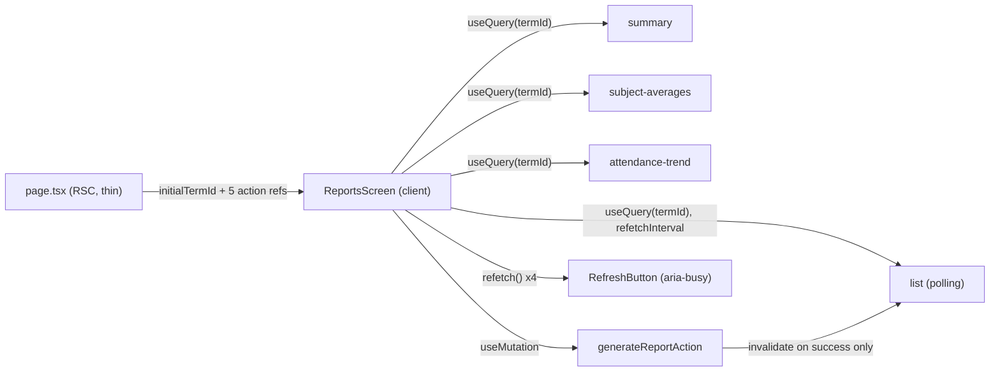

# State Design — US-E03.1 Principal Reports Dashboard

Author: `fe-state-engineer`. Companion to `plan.md` (§3/§4 open questions
#2/#3/#4/#7/#8 resolved below). Coordinates with `fe-component-architect`'s
parallel ViewModel/prop-contract pass — the boundary contract both of us must
honor: **every leaf region component receives exactly `{ status, data,
onRetry }`-shaped props and never calls `useQuery` itself** (keeps them
QueryClient-agnostic for Storybook). All `useQuery`/`useMutation` calls live
in the `ReportsScreen` container (or small colocated hook files it calls),
never in `StatGrid`/`SubjectAverageChart`/`AttendanceTrendChart`/
`PeriodicReportsTable`.

---

## 1. State Architecture Summary

- **No Zustand/Redux/Jotai.** Confirmed not needed — every piece of state
  below is server state (TanStack Query), URL state, or local UI state.
- **4 independent `useQuery` calls**, one per region, each keyed on
  `["principal","reports",<region>,termId]`. Independence is the mechanism
  that satisfies AC-01.3 (partial-failure isolation) — not a design choice
  layered on top, a direct consequence of 4 separate query keys/observers.
- **`termId` lives in the URL** (`?termId=HK1|HK2|FULL_YEAR`), matching this
  repo's existing filter convention (`attendance-filters.tsx`,
  `discipline` state-design). Default resolution note (open question #7,
  carried below) — resolve to `"HK2"` when absent, matching spec's own
  `[ASSUMPTION]` fallback; no real "BE-resolved current term" endpoint exists
  in this story's INT-001..004 list to do better than that today.
- **AC-01.4 (stale-response discard on rapid term switch) is solved by
  TanStack Query's key-based cache identity, not a hand-rolled race guard.**
  HK1/HK2/FULL_YEAR are three *distinct* cache entries; a late HK1 response
  updates only the HK1 cache entry and can never overwrite what's rendered
  for FULL_YEAR, because the component reads `useQuery(keys.summary("FULL_YEAR"))`
  once the selection changes — there is nothing to "discard," structurally.
  One explicit **gap to avoid**: do **not** set `placeholderData:
  keepPreviousData` (or the v4 `keepPreviousData: true` equivalent) on any of
  the 4 queries. That option is the common TanStack recommendation for
  filter-driven lists, but here it would flash the *previous* term's data
  while the new key loads — exactly what AC-01.1 forbids ("all 4 regions show
  their own skeleton then re-render"). Leave `placeholderData` unset (the
  default: a fresh key with no cache entry renders `isLoading` immediately).
- **Manual refresh (FR-010) = `refetch()`,  not a parallel state machine.**
  The query's own pending/resolved/rejected transition IS the loading/
  success/error state — no `useState<'idle'|'loading'|'error'>` anywhere.
  This is the direct antidote to §0's anti-demo risk: if the mock defaults to
  success, `refetch()` on a fresh session resolves success, full stop.
- **Poll loop (FR-008/NFR-004)** = `refetchInterval` as a function of the
  periodic-reports query's own data — no separate timer/interval state.
- **`generateReport` mutation** invalidates the list query on success (no
  optimistic append) — this trivially satisfies "no ghost row on failure"
  (AC-07.3) because nothing is added to the cache until the server confirms
  and a refetch runs.
- **Export Excel needs zero TanStack Query involvement** — pure function over
  the 4 regions' already-resolved `data` (read from the parent's existing
  query results), triggered by a plain button click handler. Flag to
  `fe-nextjs-engineer`: do not build a query/mutation for this.
- **RSC↔client boundary**: `page.tsx` is a thin async RSC — no
  `bootstrap/di` calls, no data fetching. It reads the initial `termId` from
  Next's `searchParams` prop (defaulting to `"HK2"`), and passes 5 Server
  Action refs (4 region fetchers + `generateReportAction`) as props to the
  client `ReportsScreen`, matching the `discipline` precedent ("query `queryFn`
  calls a `'use server'` action") — **not** the `principal/teachers` precedent
  (which RSC-prefetches data directly), because here 4 independently-loading
  regions with per-region skeletons are explicitly what the spec wants, and
  RSC-prefetching all 4 up front would collapse that into one waterfall/one
  combined loading state. `(app)/layout.tsx` already wraps `children` (which
  includes nested `principal/reports/layout.tsx` → `page.tsx`) in
  `ReactQueryProvider` — confirmed, no new provider needed at this route.

---

## 2. State Inventory

| State | Type | Owner | Shape | Reason |
| --- | --- | --- | --- | --- |
| `termId` | URL (`?termId=`) | `ReportsScreen` (reads `useSearchParams`) | `"HK1" \| "HK2" \| "FULL_YEAR"` | Shareable/deep-linkable; drives all 4 query keys; matches `attendance`/`discipline` URL-filter convention |
| `reportsSummary` | Server state (TanStack Query) | `ReportsScreen` → `StatGrid` region | `ReportsSummaryEntity` | Remote, term-scoped aggregate |
| `subjectAverages` | Server state (TanStack Query) | `ReportsScreen` → `SubjectAverageChart` region | `SubjectAverageEntity[]` | Remote, term-scoped |
| `attendanceTrend` | Server state (TanStack Query) | `ReportsScreen` → `AttendanceTrendChart` region | `AttendanceTrendPointEntity[]` | Remote, term-scoped, last 6 weeks |
| `periodicReports` | Server state (TanStack Query, polling) | `ReportsScreen` → `PeriodicReportsTable` region | `{ items: ReportListItemEntity[]; nextCursor: string \| null; hasMore: boolean }` | Remote, term-scoped, single-page `useQuery` (see §4 rationale) |
| `generateReport` mutation | Server state (TanStack Mutation) | `PeriodicReportsTable`'s "Tạo báo cáo" header button | `{ termId: Term } → ReportListItemEntity` | Write — POST, Should |
| `refresh` action | Derived from the 4 queries' own `refetch()` | Toolbar `RefreshButton` | n/a (no owned state) | See §6 — button calls `refetch()` on all 4, `aria-busy` from combined `isFetching` |
| Export Excel trigger | Local UI (`useState<boolean>` pending flag, not TanStack) | Toolbar `ExportExcelButton` | `boolean` | Pure client-side generation, no server round-trip |
| RSC static prop: `initialTermId` | RSC → prop | `page.tsx` → `ReportsScreen` | `Term` | Resolved once server-side from `searchParams.termId ?? "HK2"`, avoids a client-side flash before the URL is canonicalized |
| RSC prop: Server Action refs | RSC → prop | `page.tsx` → `ReportsScreen` | see §9 | `getReportsSummaryAction`, `getSubjectAveragesAction`, `getAttendanceTrendAction`, `getPeriodicReportsAction`, `generateReportAction` |

---

## 3. State Flow

### RSC → Client

```
app/[locale]/t/[tenant]/(app)/principal/reports/
  layout.tsx   (RSC guard — Phase 3, fe-lead's D-1, not this doc's concern)
  page.tsx     (RSC, async, thin)
    ↓ const { termId } = await searchParams  // Next 15 async searchParams
    ↓ const initialTermId = isValidTerm(termId) ? termId : "HK2"
    ↓ passes initialTermId + 5 Server Action refs as props
    ↓ NO bootstrap/di call, NO data fetch here
  ReportsScreen (client)
    ↓ useSearchParams() for live termId (canonicalizes to initialTermId via
      router.replace on mount if absent, so the URL always reflects the
      resolved term — satisfies AC-01.2's "pre-selected without a click")
    ↓ 4x useQuery(keys.<region>(termId), () => actionRef(termId))
    ↓ maps each query's {status, data, error, isFetching} → the shared
      { status: 'loading'|'error'|'empty'|'success', data, onRetry } shape
    ↓ passes that shape to each dumb region component
```

### Term change → sync re-fetch (FR-003)

```
User selects a new term in TermRadioGroup
  → setTermId(newTerm): router.replace(`${pathname}?termId=${newTerm}`, { scroll: false })
  → useSearchParams() re-renders with the new termId
  → all 4 useQuery calls now key off the new termId → 4 fresh cache entries
    → isLoading (no data yet) → each region renders its own skeleton
  → each settles independently: 3 succeed, 1 rejects → only that one renders
    EduError+retry (AC-01.3), because failure is per-query-observer, not
    shared
```

### Manual refresh (FR-010, §0 anti-demo)

```
User clicks "Làm mới" (Refresh)
  → onClick: Promise.allSettled([
      summaryQuery.refetch(), subjectAvgQuery.refetch(),
      attendanceTrendQuery.refetch(), reportsQuery.refetch(),
    ])
  → button aria-busy = summaryQuery.isFetching || subjectAvgQuery.isFetching
                     || attendanceTrendQuery.isFetching || reportsQuery.isFetching
  → each query's OWN resolve/reject drives that region's state — no shared
    "is refreshing" boolean, no scripted first-failure anywhere
```

### Mutation → Server Action → invalidation (FR-008, Should)

```
User clicks "Tạo báo cáo" (New report, in table header)
  → useMutation.mutate({ termId })
  → NO onMutate optimistic append (§6 rationale)
  → mutationFn: generateReportAction(termId)  ('use server', calls
    makeGenerateReportUseCase() via bootstrap/di)
  → onSuccess: queryClient.invalidateQueries({ queryKey: principalReportsKeys.list(termId) })
  → onError: toast.error(t(`reports.errors.${errorKey}`)) — no cache touched,
    so no ghost row (AC-07.3) as a direct consequence, not a special case
```

### Poll loop (FR-008/NFR-004, UC-07)

```
periodicReports query (already mounted, keyed by termId)
  refetchInterval: (query) =>
    query.state.data?.items.some(r => r.status === "generating")
      ? POLL_INTERVAL_MS   // 5000
      : false
  → while ANY row is "generating", TanStack re-runs the SAME queryFn every
    5s (single re-fetch covers ALL generating rows at once — satisfies
    AC-07.4's "a single re-fetch... each transitioning independently")
  → once the mock/BE flips every row to "ready", the predicate returns
    false → polling stops automatically, no manual clearInterval bookkeeping
```

### Mermaid overview



---

## 4. Query Key Hierarchy + Cache Policy

```ts
// src/features/principal/presentation/reports/principal-reports-keys.ts
// pure TS — safe to import client-side, no server imports

export type Term = "HK1" | "HK2" | "FULL_YEAR";

export const principalReportsKeys = {
  all:             ()               => ["principal", "reports"]                        as const,
  summary:         (termId: Term)   => ["principal", "reports", "summary", termId]      as const,
  subjectAverages: (termId: Term)   => ["principal", "reports", "subject-averages", termId] as const,
  attendanceTrend: (termId: Term)   => ["principal", "reports", "attendance-trend", termId] as const,
  list:            (termId: Term)   => ["principal", "reports", "list", termId]         as const,
} as const;
```

### Cache policy

| Query | staleTime | gcTime | refetchOnWindowFocus | refetchInterval | Notes |
| --- | --- | --- | --- | --- | --- |
| `summary` | 2 min | 10 min | false | — | Aggregate, low churn (matches `discipline.conductList` rationale) |
| `subjectAverages` | 2 min | 10 min | false | — | Same aggregate-churn profile |
| `attendanceTrend` | 2 min | 10 min | false | — | Same |
| `list` | 30 s | 5 min | false | conditional, see §3 | Shorter `staleTime` than the 3 aggregates — this region can change out-of-band (a report finishes generating) even without a term switch |

Global default (`react-query-provider.tsx`): `staleTime: 60_000`, `retry: 1`,
`refetchOnWindowFocus: false`. Overrides above are deliberate per-query
tuning, not a repo-wide change. Retry only when `error.retryable === true`
(never on `401`/`403`/`term-not-found`).

**`refetchIntervalInBackground` — deliberately NOT set (stays default
`false`).** While a `generating` row exists, polling pauses when the tab is
hidden and resumes (with an immediate refetch) on refocus — acceptable per
spec's own "leaning silent" NFR-005 spirit and avoids burning requests for a
Should-priority background job the principal isn't watching. Resolves open
question #8 (a single failed poll attempt) as: on any single poll rejection,
`useQuery`'s own `retry: 1` (global default) handles a transient blip
transparently; only a **persistent** failure surfaces `isError` on the list
region — no separate "poll failed silently" branch to hand-build.

### Pagination (INT-004, resolves open question #4)

**Single-page `useQuery`, not `useInfiniteQuery`.** Spec's own note (a school
generates few reports per term) plus no product requirement for "load more"
UX (open question #5 in spec, unresolved by `ba-lead`) means adding
`useInfiniteQuery` now is speculative complexity. The domain/repository
interface already returns `{ items, nextCursor, hasMore }` (Phase 1) — if
`ba-lead` later confirms pagination UX is needed, upgrading `list` to
`useInfiniteQuery` is additive (new key shape unaffected, `nextCursor` is
already in the payload).

---

## 5. Invalidation Map

| Trigger (mutation/event) | Keys invalidated | Why |
| --- | --- | --- |
| `generateReport` succeeded | `principalReportsKeys.list(termId)` | New row must appear; no optimistic add, so invalidate is the only way it appears |
| `generateReport` failed | none | No ghost row — nothing was written to cache in the first place |
| Manual refresh click | none via `invalidateQueries` — uses direct `refetch()` on all 4 active queries instead | Refresh is a re-fetch of the CURRENT term's data, not a cache-bust of all term variants; using `refetch()` avoids needlessly invalidating (and re-fetching) other cached term entries the user isn't looking at |
| `refetchInterval` tick (list, while generating) | none — this is a background refetch of the SAME key, not an invalidation | Polling and invalidation are different mechanisms; polling re-runs the same query, invalidation marks other cache entries stale |
| Term switch | none — new query keys are used, no invalidation of the old term's cache (old term's data stays cached for `gcTime`, useful if the user switches back) | Distinct keys already isolate old vs new; invalidating would be wasted work |

---

## 6. Mutations & Optimistic Strategy

### `generateReport` (FR-008, Should) — NO optimistic update

```
onMutate: — (none; do not append a temp row)
onError({ errorKey }):
  toast.error(t(`reports.errors.${errorKey}`))
onSuccess:
  queryClient.invalidateQueries({ queryKey: principalReportsKeys.list(termId) })
```

**Why no optimistic append here** (unlike `discipline`'s `recordViolation`
prepend): the row's very first rendered state (`status: "generating"`,
disabled download) is IDENTICAL whether it's a locally-fabricated optimistic
row or the server-confirmed one — there's no perceptible latency win worth
the rollback-on-failure complexity, and skipping it makes AC-07.3 ("no ghost
row on failure") a trivial non-issue rather than something to get right in an
`onError` handler. This is a deliberate strategy call, flagged here so
`fe-nextjs-engineer` doesn't add optimism "by convention" from the
`discipline` precedent.

### Manual refresh — not a mutation at all

`refetch()` is a query method, not a `useMutation`. No `onMutate`/`onError`/
`onSettled` triple applies. Treat the Toolbar's refresh handler as a plain
async function that calls `refetch()` on the 4 active query results and
awaits `Promise.allSettled` purely to know when to release `aria-busy`; the
actual success/error UI per region comes from that region's own query state,
not from the refresh handler's return value.

### Export Excel — not a TanStack construct

```ts
// pure function, no query/mutation
function exportReportsToExcel(input: {
  summary: ReportsSummaryEntity;
  subjects: SubjectAverageEntity[];
  weeks: AttendanceTrendPointEntity[];
  reports: ReportListItemEntity[];
  termId: Term;
}): Blob { /* ... */ }
```
Button handler: read the 4 queries' current `.data` (already resolved,
otherwise disable the button while any region is loading/erroring), call the
pure function, trigger a browser download. `useState<boolean>` only for a
"generating file…" disabled-button flash if the function is non-trivial;
no cache interaction of any kind.

---

## 7. Async State Machine

Each of the 4 regions maps its `useQuery` result to the shared
`{ status, data, onRetry }` shape the component-architect's leaf components
consume:

| Query state | Mapped `status` | UI treatment |
| --- | --- | --- |
| `isLoading` (`fetchStatus !== 'idle'`, no cached data) | `"loading"` | `EduSkeleton` (cards / chart-shaped / table-rows variant per §5 of spec), ≤320ms — never a spinner for page data |
| `isSuccess && data` empty (`subjects: []` / `weeks: []` / `items: []`) | `"empty"` | Dedicated empty state per region (FR-007 pattern) — visually/structurally distinct from loading AND error (AC-04.7) |
| `isError` | `"error"` | Scoped `EduError` + retry; retry calls `onRetry = () => query.refetch()`; only offer retry UI if `error.retryable` (but the retry AFFORDANCE itself is always shown per AC-04.5 — "error persists, no silent infinite loop" means retry stays available, it doesn't auto-loop) |
| `isSuccess && data` non-empty (stat cards: always, no empty concept) | `"success"` | Render real content |
| `isFetching && data already present` (background refetch / manual refresh / poll tick) | still `"success"` with an additional `isRefetching` flag passed alongside (or reflected via the Toolbar's combined `aria-busy`, not a per-region skeleton-again) | Existing content stays visible — do NOT re-show skeleton on a background refetch, only on first load / term-key change (this is a `fe-component-architect` prop-shape detail to confirm: an optional `isRefetching?: boolean` alongside `status: "success"`) |

### Error → failure → i18n key mapping

Server Actions return `{ ok: false, errorKey: PrincipalReportsFailure["type"] }`
(never translated server-side, per `i18n.md`). Presentation:
`t(`reports.errors.${errorKey}`)`.

| Failure type | i18n key | Scenario |
| --- | --- | --- |
| `network-error` | `reports.errors.network-error` | Transport failure, `retryable: true` |
| `term-not-found` | `reports.errors.term-not-found` | INT-001 `[ASSUMPTION]` fallback trigger — see §8 note below on where the fallback itself is handled |
| `generation-failed` | `reports.errors.generation-failed` | `generateReport` rejected |
| `unauthorized` | `reports.errors.unauthorized` | Should not reach client (server gate); defensive mapping only |
| `unknown` | `reports.errors.unknown` | Catch-all |

**Resolves open question #7 (TERM_NOT_FOUND fallback locus):** the domain
use-case stays a thin delegate (per `plan.md` Phase 1) and does NOT
special-case this. Recommend the mock repository (and, later, the real
repository) never actually emits `term-not-found` for `"HK2"` (the URL
default already resolves to `"HK2"` per §1) — so in practice this failure
type is reachable only if a stale/invalid `?termId=` value slips through
`isValidTerm()`'s check in `page.tsx`, which should redirect/clamp before
ever reaching a query. If BE later surfaces `TERM_NOT_FOUND` for a live
`"HK2"` for some other reason, add a **presentation-level** re-issue (the
region's query catches `term-not-found` and re-fires with `"HK2"` once) —
not a domain rule.

**Confirmed by `fe-lead` (2026-07-12): final decision, not open.** Mock/BE
never emits `term-not-found` for the URL-defaulted `"HK2"`; the
presentation-level re-issue above is a defensive fallback only, no domain
rule is added for this.

---

## 8. Race Conditions & Resolution

### Rapid term switch (AC-01.4)

**Risk:** HK1 → HK2 → FULL_YEAR switched before HK1's response returns.

**Resolution:** already covered structurally in §1/§3 — distinct query keys
per term mean there is nothing to race. The late HK1 response updates only
the HK1 cache entry (useful if the user switches back later within
`gcTime`), and the screen is rendering whichever `useQuery(keys.X(termId))`
matches the CURRENT `termId` from the URL — it literally cannot show HK1
data while `termId === "FULL_YEAR"`. No `AbortController`/ignore-flag needed.

### One region fails while the other 3 + the new term switch succeed (AC-01.3)

**Risk:** term switch fires 4 queries; 1 fails.

**Resolution:** 4 independent `useQuery` calls with 4 independent
`isError`/`isSuccess` flags. There is no combined/joined query — a
`Promise.all`-style combined loading state would have made this a real race
to solve; independent hooks make it a non-issue by construction. State this
explicitly as the mechanism per the task brief.

### Poll tick landing while a manual refresh is also in flight (list region)

**Risk:** `refetchInterval` fires the list query at the same moment the user
clicks "Làm mới," which also calls `reportsQuery.refetch()` on the same key.

**Resolution:** TanStack Query deduplicates concurrent fetches for the SAME
query key/observer — calling `refetch()` while a poll-triggered fetch is
already in flight for that key does not double-fire the network call; both
resolve from the single in-flight promise. No extra guard needed.

### `generateReport` succeeds but the poll's next tick hasn't run yet

**Risk:** After a successful `generateReport`, the new row should appear
immediately (AC-07.1 says "immediately," not "on next poll").

**Resolution:** `onSuccess`'s `invalidateQueries` triggers an IMMEDIATE
refetch of `list(termId)` regardless of the poll timer's cadence (TanStack
invalidation is not throttled by `refetchInterval`) — the new `generating`
row appears right away, and the *existing* `refetchInterval` predicate
(already true, since the new row is `generating`) picks up the subsequent
polling cadence from there with no special-casing.

### Term change while a report for a DIFFERENT term is still `generating`

**Risk (open question #7 in spec, UC-07):** principal switches away from the
term whose report is generating.

**Resolution (leaning, matches spec's own recommendation):** polling is
scoped to the CURRENTLY ACTIVE `list(termId)` query only — if the user
navigates away from that term, the query becomes unobserved and TanStack
Query does not run `refetchInterval` for unobserved queries (no visible
component reading it). This means polling for the away-term's row **pauses**
while unviewed, and resumes (with a fresh fetch) the moment the user switches
back to that term — matching the spec's "continue in background" *intent*
loosely (the row's true generation presumably continues server-side
regardless; only the CLIENT's polling of it pauses, which is the correct,
resource-frugal client behavior and doesn't affect server-side state).

**Confirmed by `fe-lead` (2026-07-12): final decision, not open.** Poll
pausing when the term/region is no longer observed is intentional, not an
oversight — a Should-priority, normal-lane item does not warrant a
background-kept-alive query (e.g. `queryClient.prefetchQuery` on an interval
regardless of observers). Noted explicitly here so a reviewer does not flag
the pause-on-navigate-away behavior as a missed requirement.

---

## 9. RSC ↔ Client Boundary (explicit)

### What `page.tsx` (RSC) provides

```ts
// principal-reports-page.i-vm.ts (coordinate exact shape with fe-component-architect)
interface ReportsScreenVM {
  initialTermId: Term;   // searchParams.termId ?? "HK2", clamped to the Term union
  onGetReportsSummary:   (termId: Term) => Promise<{ ok: true; value: ReportsSummaryEntity } | { ok: false; errorKey: PrincipalReportsFailure["type"] }>;
  onGetSubjectAverages:  (termId: Term) => Promise<...>;
  onGetAttendanceTrend:  (termId: Term) => Promise<...>;
  onGetPeriodicReports:  (termId: Term) => Promise<...>;
  onGenerateReport:      (termId: Term) => Promise<...>;
}
```

No `bootstrap/di` call and no domain/infrastructure import in `page.tsx`
itself — all 5 handlers are imported from a colocated `actions.ts`
(`'use server'`), each internally calling its own `makeXxxUseCase()` via
`bootstrap/di/principal-reports.di.ts`. This mirrors the `discipline`
state-design precedent exactly.

### What the client queries (NOT in RSC)

- `principalReportsKeys.summary(termId)` → `queryFn: () => onGetReportsSummary(termId)`
- `principalReportsKeys.subjectAverages(termId)` → `queryFn: () => onGetSubjectAverages(termId)`
- `principalReportsKeys.attendanceTrend(termId)` → `queryFn: () => onGetAttendanceTrend(termId)`
- `principalReportsKeys.list(termId)` → `queryFn: () => onGetPeriodicReports(termId)`, `refetchInterval` per §3

All 4 `queryFn`s call their Server Action, unwrap the `{ ok, value | errorKey }`
result, and `throw` a small `{ errorKey }` object on `ok: false` so
`useQuery`'s own `isError`/`error` reflects it (do not swallow into a
success-shaped empty value — that would misrepresent an error as an empty
state, violating AC-04.7's "no two states identical").

### What stays server-only

- `bootstrap/di/principal-reports.di.ts` — `'server-only'`.
- `infrastructure/reports/` — mock + real repositories, DTOs, mapper.
- `principal/reports/layout.tsx` guard (Phase 3) — RSC-only, redirects before
  any client code mounts, so a rejected role never even reaches
  `ReportsScreen`/its queries (AC-06.2/06.4's "zero requests" requirement is
  satisfied at the layout level, before this doc's query layer exists at
  all).

---

## 10. Poll-Loop Test Strategy (confirmed by `fe-lead`, 2026-07-12 — final)

**Numbers:** `POLL_INTERVAL_MS = 5000` (5s), well inside NFR-004's "≤10s"
target; stop condition = no `"generating"` row in the current page's
`items`; no backoff (spec explicitly frames this as a normal-lane Should
item — a fixed interval is enough, don't build exponential backoff for it).

**Where the transition is proven (per `tdd.md`'s injected-clock rule, no real
timers):**

1. **Primary proof — mock-repository layer (Phase 2, already planned).**
   `MockPrincipalReportsRepository`'s constructor-injected `now: () => number`
   clock is exercised directly: call `generateReport()`, advance the injected
   clock past `readyAt`, call `getPeriodicReports()` again, assert the row
   flipped to `"ready"`. This is the deterministic, timer-free proof that
   "poll causes a status flip" — it doesn't need React, TanStack, or fake
   timers at all.
2. **Poll-predicate proof — a pure function, unit-tested with no timers.**
   Extract the `refetchInterval` decision into a standalone pure function
   (e.g. `getReportsPollInterval(items: ReportListItemEntity[]): number | false`)
   in the presentation layer, unit-test it directly with plain data fixtures
   (`items` containing/not containing a `"generating"` row) — zero timer
   machinery needed since it's a pure predicate, not a scheduled effect.
   `fe-nextjs-engineer` wires `refetchInterval: (query) =>
   getReportsPollInterval(query.state.data?.items ?? [])`.
3. **Deliberately NOT attempting:** a `renderHook` + `vi.useFakeTimers()` +
   live `QueryClient` integration test asserting the actual interval firing
   in-process. This repo has no existing precedent for combining fake timers
   with a real `QueryClient`'s internal scheduling (grep confirms zero
   `refetchInterval` usage anywhere yet), and TanStack's internal timer/
   `setTimeout` bookkeeping is known to interact unreliably with
   `vi.useFakeTimers()` across versions — chasing that proof risks a flaky
   test for marginal added confidence over (1)+(2) above. The actual
   in-browser interval firing is covered at E2E tier per spec §10's own "Proof
   owed" list (AC-07.2, "polling transition in place without navigation").

**Confirmed by `fe-lead` (2026-07-12): final decision, not open.** Agreed with
the flake-risk/no-precedent rationale above — the pure-predicate unit test
(2) + the mock-repo injected-clock test (1) + E2E poll-transition (AC-07.2)
are sufficient per `tdd.md`. No hook-level fake-timer test is to be added for
this story.

---

## Summary for fe-lead

**Query key root:** `["principal", "reports"]`

**4 independent keys, one per region, `termId` embedded:**
`summary(termId)` · `subjectAverages(termId)` · `attendanceTrend(termId)` ·
`list(termId)` (single-page, not infinite — resolves open Q#4)

**Cache:** aggregates (summary/subjectAverages/attendanceTrend) 2min/10min
stale/gc; `list` 30s/5min (shorter — polling target). No
`placeholderData`/`keepPreviousData` on any of the 4 (would flash stale-term
data, contradicts AC-01.1's fresh-skeleton requirement).

**AC-01.4 race:** solved natively by distinct query keys per term — no
hand-rolled cancellation/ignore-flag.

**AC-01.3 partial failure:** solved natively by 4 independent `useQuery`
observers — no combined/joined query.

**Poll:** `refetchInterval` = 5000ms while any `list` row is `"generating"`,
else `false`; predicate extracted as a pure, timer-free-testable function.

**`generateReport` mutation:** no optimistic update; `onSuccess` →
`invalidateQueries(list(termId))`; `onError` → toast only. No ghost row is a
direct consequence, not a special case.

**Export Excel:** pure client-side function over already-resolved query
`data` — no TanStack Query involvement at all.

**`termId`:** URL param (`?termId=`), defaults to `"HK2"` when absent
(resolves open Q#3, matches spec's `[ASSUMPTION]`).

**RSC↔client:** `page.tsx` is thin (no DI/data-fetch); all 5 Server Action
refs passed as props; client owns all 4 queries + 1 mutation. `(app)/layout.tsx`
already provides `ReactQueryProvider` at this route — confirmed.

**Confirmed by `fe-lead` (2026-07-12) — all final, no longer open:**
1. TERM_NOT_FOUND fallback locus (§7) — mock/BE never emits it for the
   URL-defaulted `"HK2"`; presentation-level re-issue is a defensive fallback
   only, no domain rule added.
2. Off-screen-term poll-pause behavior (§8, last race) — client-side pause is
   the intentional, final behavior for this Should-priority/normal-lane item;
   not a background-kept-alive query. Called out explicitly so reviewers
   don't flag it as a gap.
3. No additional hook-level fake-timer integration test for the poll loop —
   the pure-predicate unit test + mock-repo injected-clock test + E2E
   poll-transition (AC-07.2) are sufficient per `tdd.md`.
