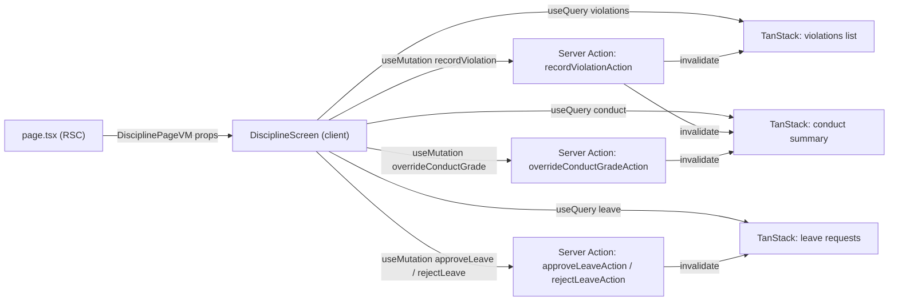

# State Design — US-E09.1 Discipline Screen

## 1. State Architecture Summary

This screen is a 3-tab command-heavy feature (Violations / Conduct / Leave). Because the `core` BE service is not shipped yet, the entire server layer is **mock-first** (`USE_MOCK` flag in `bootstrap/lib/mock.ts`). The client is therefore the owner of all async state through **TanStack Query** — there is no meaningful RSC pre-fetch to hand down (no real data at build/request time).

**Key decisions:**

- Active tab + all filter params live in **URL searchParams** (shareable, back-button-safe).
- The three list queries are independent; they are **not** pre-fetched in RSC. The RSC `page.tsx` provides only static props (tenantId, classId from session, role flag).
- All mutations go through **Server Actions** (`'use server'` in `app/[locale]/(dashboard)/[role]/discipline/actions.ts`). The client fires them via `useTransition` + `useMutation` wrappers.
- Optimistic updates apply to the two highest-frequency mutations: `recordViolation` (prepend to violations list) and `approveLeave`/`rejectLeave` (toggle status in leave list). `overrideConductGrade` is non-optimistic (derived score recalculation is domain-heavy; safer to invalidate and refetch).
- No global store is introduced. No Zustand/Redux/Jotai.
- Conduct score derivation (`100 - sum(violation points)`) is a **pure domain computation** (`calculateConductPoints.use-case.ts`) run server-side per request; the client receives the already-computed summary and only mutates on override.

---

## 2. State Inventory

| State | Type | Owner | TypeScript shape | Reason |
|---|---|---|---|---|
| `activeTab` | URL (`?tab=violations\|conduct\|leave`) | `DisciplineScreen` (reads `useSearchParams`) | `'violations' \| 'conduct' \| 'leave'` | Shareable, back-button-safe |
| `classId` filter | URL (`?classId=`) | `DisciplineFilters` | `string \| undefined` | Shareable; principal selects across all classes |
| `semester` filter | URL (`?semester=HK1\|HK2`) | `DisciplineFilters` | `'HK1' \| 'HK2' \| undefined` | Shareable, used for violations + conduct |
| `severityFilter` | URL (`?severity=low\|medium\|high`) | `ViolationsTab` | `'low' \| 'medium' \| 'high' \| undefined` | Shareable violations filter |
| `violations` list | Server state (TanStack Query) | `ViolationsTab` | `Violation[]` | Remote, cursor-paginated |
| `conductSummary` list | Server state (TanStack Query) | `ConductTab` | `ConductSummary[]` | Remote, per-class per-semester |
| `leaveRequests` list | Server state (TanStack Query) | `LeaveTab` | `LeaveRequest[]` | Remote, cursor-paginated |
| `recordViolation` mutation | Server state (TanStack Mutation) | `ViolationForm` (bottom-sheet) | `RecordViolationInput` | Write — POST violations |
| `notifyParent` mutation | Server state (TanStack Mutation) | `ViolationForm` | `{ violationId, studentId }` | Write — POST noti; fires after `recordViolation` if toggle on |
| `overrideConductGrade` mutation | Server state (TanStack Mutation) | `ConductOverrideDialog` | `{ studentId, overrideScore, note }` | Write — PUT conduct/:studentId/override |
| `approveLeave` mutation | Server state (TanStack Mutation) | `LeaveTab` | `{ leaveId: string }` | Write — PUT leave/:id/approve |
| `rejectLeave` mutation | Server state (TanStack Mutation) | `RejectLeaveDialog` | `{ leaveId: string, reason: string }` | Write — PUT leave/:id/reject |
| `violationForm` fields | Local form state (react-hook-form) | `ViolationForm` | `ViolationFormValues` (see §6) | Not shared; validated with zod |
| `conductOverrideForm` | Local form state (react-hook-form) | `ConductOverrideDialog` | `{ overrideScore: number, note: string }` | Dialog-scoped, not shared |
| `rejectReasonForm` | Local form state (react-hook-form) | `RejectLeaveDialog` | `{ reason: string }` | Dialog-scoped; reason is required |
| `violationFormOpen` | Local UI state (`useState`) | `ViolationsTab` | `boolean` | Controls bottom-sheet visibility |
| `overrideDialogOpen` | Local UI state (`useState`) | `ConductTab` | `boolean` | Controls override dialog |
| `rejectDialogOpen` | Local UI state (`useState`) | `LeaveTab` | `boolean` | Controls reject reason dialog |
| `selectedLeave` | Local UI state (`useState`) | `LeaveTab` | `LeaveRequest \| null` | Which leave request is being rejected |
| `selectedStudent` | Local UI state (`useState`) | `ConductTab` | `ConductSummary \| null` | Which student override is targeting |
| RSC static props: `tenantId`, `classId`, `role` | RSC → ViewModel prop | `page.tsx` → `DisciplineScreenVM` | `DisciplinePageVM` | Session-derived; never re-fetched client-side |

---

## 3. State Flow

### RSC → Client

```
app/[locale]/(dashboard)/teacher/discipline/page.tsx  (RSC)
  ↓ reads session cookie (via bootstrap/di) → extracts tenantId, teacherClassId
  ↓ builds DisciplinePageVM { tenantId, classId, role: 'teacher' }
  ↓ reads ?tab, ?classId, ?semester, ?severity from searchParams (URL)
  ↓ passes DisciplinePageVM as props to DisciplineScreen (Client Component)

app/[locale]/(dashboard)/principal/discipline/page.tsx  (RSC)
  ↓ reads session → tenantId, role: 'principal', classId: undefined (all classes)
  ↓ passes DisciplinePageVM { tenantId, classId: undefined, role: 'principal' }
  ↓ passes to DisciplineScreen
```

The RSC does NOT fetch violations/conduct/leave data — those lists are client-queried on tab render. This avoids waterfall (3 concurrent requests on mount, not serial).

### Mutation → Server Action → Invalidation

```
User submits ViolationForm
  → useMutation.mutate(recordViolationInput)
  → onMutate: optimistic prepend to violations cache
  → Server Action: recordViolationAction(input)  ('use server')
    → makeRecordViolationUseCase() via bootstrap/di
    → repo.recordViolation(input) [mock or real]
    → if notifyParent: repo.notifyParent(violationId, studentId) [noti service]
  → onError: rollback violations cache to snapshot
  → onSettled: invalidateQueries(disciplineKeys.violations(...))
              + invalidateQueries(disciplineKeys.conduct(...))  ← points recalc
```

```
User clicks Approve on a leave request
  → useMutation.mutate({ leaveId })
  → onMutate: optimistic status='approved' in leave cache
  → Server Action: approveLeaveAction(leaveId)  ('use server')
  → onError: rollback leave cache
  → onSettled: invalidateQueries(disciplineKeys.leaveRequests(...))
```

```
GVCN submits ConductOverride
  → useMutation.mutate({ studentId, overrideScore, note })
  → NO optimistic update (score derivation is complex)
  → Server Action: overrideConductGradeAction(...)
  → onSettled: invalidateQueries(disciplineKeys.conduct(...))
```

### Mermaid overview



---

## 4. Query Key Hierarchy + Cache Policy

### Key factory

```ts
// src/features/discipline/presentation/discipline-keys.ts
// (safe to import in client components — pure TS, no server imports)

export type ViolationFilters = {
  tenantId: string;
  classId?: string;
  semester?: 'HK1' | 'HK2';
  severity?: 'low' | 'medium' | 'high';
};

export type ConductFilters = {
  tenantId: string;
  classId?: string;
  semester?: 'HK1' | 'HK2';
};

export type LeaveFilters = {
  tenantId: string;
  classId?: string;
};

export const disciplineKeys = {
  all:          ()                        => ['discipline']                          as const,
  violations:   ()                        => ['discipline', 'violations']            as const,
  violationList: (f: ViolationFilters)    => ['discipline', 'violations', 'list', f] as const,
  conduct:      ()                        => ['discipline', 'conduct']               as const,
  conductList:  (f: ConductFilters)       => ['discipline', 'conduct', 'list', f]   as const,
  leave:        ()                        => ['discipline', 'leave']                 as const,
  leaveList:    (f: LeaveFilters)         => ['discipline', 'leave', 'list', f]     as const,
} as const;
```

### Cache policy

| Query | staleTime | gcTime | refetchOnWindowFocus | Notes |
|---|---|---|---|---|
| `violationList` | 2 min | 5 min | false | Moderate — discipline list doesn't change by the second |
| `conductList` | 3 min | 10 min | false | Derived scores; only changes on violation write or override |
| `leaveList` | 1 min | 5 min | false | More time-sensitive; teacher is actively acting on it |

Global default from `react-query-provider.tsx` is `staleTime: 60_000`, `retry: 1`. Override per query where needed (violations + conduct go higher, leave stays at default or lower).

Retry strategy: only when `error.retryable === true`. Never retry on `401`/`403`.

Pagination: Violations and Leave are cursor-based (`meta.pagination.nextCursor` / `hasMore`). Model with `useInfiniteQuery`. Conduct summary is a flat list per semester (no pagination needed — bounded by class size).

---

## 5. Invalidation Map

| Trigger (mutation / event) | Keys invalidated | Why |
|---|---|---|
| `recordViolation` succeeded | `disciplineKeys.violations()` (all variants) + `disciplineKeys.conduct()` (all variants) | New violation changes the list AND recalculates conduct scores |
| `overrideConductGrade` succeeded | `disciplineKeys.conduct()` (all variants) | Override changes conduct summary |
| `approveLeave` succeeded | `disciplineKeys.leave()` (all variants) | Status changed |
| `rejectLeave` succeeded | `disciplineKeys.leave()` (all variants) | Status changed |
| `notifyParent` (fires after recordViolation) | No query invalidation — notification is fire-and-forget | Noti service is separate; no cached state to bust |

All invalidations happen in `onSettled` (fires on both success and error) to guarantee cache is eventually consistent even if rollback occurred.

---

## 6. Mutations & Optimistic Strategy

### `recordViolation`

```
onMutate(input):
  1. Cancel in-flight violationList queries
  2. Snapshot = queryClient.getQueryData(disciplineKeys.violationList(currentFilters))
  3. Build optimisticViolation: { id: 'temp-' + Date.now(), ...input, status: 'pending', createdAt: now }
  4. queryClient.setQueryData(violationList, prepend optimisticViolation to first page)
  5. Return { snapshot, filters: currentFilters }

onError(_, __, context):
  queryClient.setQueryData(disciplineKeys.violationList(context.filters), context.snapshot)
  toast.error(t(`discipline.errors.${errorKey}`))

onSettled:
  queryClient.invalidateQueries({ queryKey: disciplineKeys.violations() })
  queryClient.invalidateQueries({ queryKey: disciplineKeys.conduct() })

Post-success side-effect (NOT in mutation, called from onSuccess):
  if (input.notifyParent) { notifyParentMutation.mutate({ violationId: data.id, studentId: input.studentId }) }
```

**ViolationFormValues (react-hook-form + zod):**

```ts
type ViolationFormValues = {
  studentId: string;          // required, from class roster
  violationType: ViolationType; // union of 9 types
  severity: 'low' | 'medium' | 'high';
  period: string;             // class period / time
  description: string;        // free text, required
  notifyParent: boolean;      // toggle
};
```

### `approveLeave`

```
onMutate({ leaveId }):
  1. Cancel leaveList queries
  2. Snapshot = queryClient.getQueryData(leaveList(currentFilters))
  3. Set optimistic status: find leaveId in cache, set status = 'approved'
  4. Return { snapshot, filters: currentFilters }

onError(_, __, context):
  queryClient.setQueryData(leaveList(context.filters), context.snapshot)
  toast.error(t(`discipline.errors.${errorKey}`))

onSettled:
  queryClient.invalidateQueries({ queryKey: disciplineKeys.leave() })
```

### `rejectLeave`

Same shape as `approveLeave` but optimistic status = `'rejected'`, and the form includes `reason: string` (required, zod min(1)).

```ts
// RejectLeaveFormValues
type RejectLeaveFormValues = {
  reason: string; // required, non-empty
};
```

### `overrideConductGrade` (no optimistic update)

```
onMutate: — (no optimistic; just cancel in-flight conduct queries)
onError: toast.error(t(`discipline.errors.${errorKey}`))
onSettled: queryClient.invalidateQueries({ queryKey: disciplineKeys.conduct() })
```

```ts
// ConductOverrideFormValues
type ConductOverrideFormValues = {
  overrideScore: number;  // 0–100, integer
  note: string;           // required, reason for override
};
```

### `notifyParent` (fire-and-forget, no optimistic)

Fires after `recordViolation.onSuccess` when `notifyParent: true`. Errors are surfaced as a non-blocking toast (do not rollback violations list — the violation itself was already saved successfully).

---

## 7. Async State Machine

### Per query (violations / conduct / leave)

| State | Condition | UI treatment |
|---|---|---|
| **Loading (initial)** | `isLoading && !data` (no cached data) | Skeleton rows — table skeleton matching column count; tab content shows skeleton, not spinner |
| **Loading (background refetch)** | `isFetching && !!data` | Subtle refetch indicator (optional thin progress bar at top of tab panel); existing data remains visible |
| **Error** | `isError` | Error banner with retry button; `error.retryable` check — button only shown when retryable; error message from i18n key |
| **Empty** | `isSuccess && data.length === 0` | Empty state with icon + guidance text per tab (i18n key: `discipline.violations.empty`, `discipline.conduct.empty`, `discipline.leave.empty`) |
| **Success** | `isSuccess && data.length > 0` | Render table / list |

### Per mutation

| State | Condition | UI treatment |
|---|---|---|
| **Idle** | `mutation.isIdle` | Submit button enabled |
| **Pending** | `mutation.isPending` | Submit button disabled + spinner; form fields disabled |
| **Success** | `mutation.isSuccess` | Close form/dialog; toast success; cache invalidated |
| **Error** | `mutation.isError` | Toast error with i18n key; form remains open for correction |

### Error → failure → i18n key mapping

Server Actions return `{ ok: false, errorKey: DisciplineFailure["type"] }`. Presentation translates:

```ts
t(`discipline.errors.${errorKey}`)
```

**Failure union types (to be defined in `domain/failures/discipline.failure.ts`):**

| failure type | i18n key | Scenario |
|---|---|---|
| `student-not-found` | `discipline.errors.student-not-found` | Invalid studentId in violation form |
| `violation-type-invalid` | `discipline.errors.violation-type-invalid` | Unknown violation type |
| `leave-not-found` | `discipline.errors.leave-not-found` | Leave ID no longer exists |
| `leave-already-decided` | `discipline.errors.leave-already-decided` | Concurrent approve/reject on same request |
| `reject-reason-required` | `discipline.errors.reject-reason-required` | Domain guard: reject without reason |
| `conduct-override-out-of-range` | `discipline.errors.conduct-override-out-of-range` | Score not 0–100 |
| `unauthorized` | `discipline.errors.unauthorized` | Role does not have access (RBAC guard) |
| `network-error` | `discipline.errors.network-error` | Transport failure (`retryable: true`) |
| `unknown` | `discipline.errors.unknown` | Catch-all fallback |

---

## 8. Race Conditions & Resolution

### Concurrent approve + reject on the same leave request

**Risk:** Two teachers (or the same teacher double-clicking) both attempt approve and reject concurrently on the same `leaveId`. The server will accept the first and return an error for the second (`leave-already-decided`).

**Resolution:**
- Optimistic update sets status immediately → button is visually disabled after the first click (derived from optimistic cache state).
- If the second mutation arrives at the server and fails with `leave-already-decided`, the `onError` rollback restores the original cache, and the `onSettled` invalidation then fetches the authoritative state.
- The second user sees a toast with `discipline.errors.leave-already-decided`.

### recordViolation + conduct score refetch race

**Risk:** `recordViolation.onSettled` triggers `invalidateQueries(conduct)`. If a conduct refetch is already in-flight (background refetch on windowFocus or stale threshold), two concurrent conduct fetches may land out of order.

**Resolution:** TanStack Query deduplicates in-flight queries by key. The invalidation after `onSettled` will trigger exactly one fresh fetch. Stale responses are discarded automatically (Query v5 response ordering). `refetchOnWindowFocus: false` is already set globally, reducing ambient refetch noise.

### Optimistic prepend + concurrent filter change (violationList)

**Risk:** User changes `severity` or `classId` filter while `recordViolation` is in flight. The optimistic snapshot is keyed to the filter params at mutation start. After filter change, the user is looking at a different query key. The rollback targets the original key (now potentially not rendered).

**Resolution:** The rollback in `onError` correctly targets `context.filters` (the snapshot was taken from those filters). The new filter's query is unaffected by the rollback. `onSettled` invalidates the root `disciplineKeys.violations()` key which covers all filter variants — both the original and the new filter query are re-fetched.

### notifyParent failure after successful recordViolation

**Risk:** The violation is saved to `core` but the `noti` call fails. Rolling back the violation would be incorrect (the violation exists server-side).

**Resolution:** Treat `notifyParent` as a best-effort fire-and-forget. Its failure shows a non-blocking toast (`discipline.notify.failed`) but does not roll back the violation or invalidate the violations cache. The violation remains optimistically in the list and will be confirmed by `onSettled` invalidation.

---

## 9. RSC ↔ Client Boundary (explicit)

### What RSC (`page.tsx`) provides

```ts
// DisciplinePageVM — passed as props from page.tsx (RSC) to DisciplineScreen (Client Component)
interface DisciplinePageVM {
  tenantId: string;        // from session cookie (server-only read)
  classId: string | undefined; // teacher → their class; principal → undefined (sees all)
  role: 'teacher' | 'principal';
  // Initial URL state re-read from searchParams (Next.js RSC searchParams prop)
  initialTab: 'violations' | 'conduct' | 'leave';
  initialSemester: 'HK1' | 'HK2';
  // Server Action refs (serializable function references, 'use server')
  recordViolationAction: (input: RecordViolationInput) => Promise<DisciplineActionResult>;
  overrideConductGradeAction: (input: OverrideInput) => Promise<DisciplineActionResult>;
  approveLeaveAction: (leaveId: string) => Promise<DisciplineActionResult>;
  rejectLeaveAction: (leaveId: string, reason: string) => Promise<DisciplineActionResult>;
  notifyParentAction: (violationId: string, studentId: string) => Promise<DisciplineActionResult>;
}
```

### What the client queries (NOT in RSC)

- `disciplineKeys.violationList(filters)` — client queries on `ViolationsTab` mount.
- `disciplineKeys.conductList(filters)` — client queries on `ConductTab` mount.
- `disciplineKeys.leaveList(filters)` — client queries on `LeaveTab` mount.

All three queries call their own Server Actions internally (query `queryFn` calls a `'use server'` action that invokes the use-case). This keeps infrastructure off the client bundle.

### What stays server-only

- `bootstrap/di/discipline.di.ts` — `'server-only'` import, never reaches client bundle.
- `infrastructure/` layer — all mock and real repositories are server-only.
- `calculateConductPoints` use-case result — computed on the server and returned as `ConductSummary.score` in the DTO; client never recomputes this.

---

## 10. Mock-First Pattern

The `USE_MOCK` branch lives exclusively in `bootstrap/di/discipline.di.ts`:

```ts
// bootstrap/di/discipline.di.ts — 'server-only'

async function makeRepo(): Promise<IDisciplineRepository> {
  if (USE_MOCK) return new MockDisciplineRepository();
  return new DisciplineRepository(await createServerHttpClient());
}

export async function makeGetViolationsUseCase() { ... }
export async function makeRecordViolationUseCase() { ... }
export async function makeGetConductSummaryUseCase() { ... }
export async function makeOverrideConductGradeUseCase() { ... }
export async function makeGetLeaveRequestsUseCase() { ... }
export async function makeApproveLeaveUseCase() { ... }
export async function makeRejectLeaveUseCase() { ... }
```

`MockDisciplineRepository` lives at:
`src/features/discipline/infrastructure/repositories/mocks/discipline.mock.repository.ts`

It uses `mockDelay(200–350ms)` to simulate network latency, matching attendance mock patterns. Fixtures are in `mocks/fixtures.ts` (mock student names / violation types / leave requests — NOT in i18n messages per the i18n rule).

When `NEXT_PUBLIC_USE_MOCK=false` and the `core` service ships, only the DI factory and the real `DisciplineRepository` need updating. All presentation, domain, and query-key code is unchanged.

---

## Summary for fe-lead

**Query key root:** `['discipline']`

**Three independent query subtrees:**
- `['discipline', 'violations', 'list', { tenantId, classId, semester, severity }]`
- `['discipline', 'conduct', 'list', { tenantId, classId, semester }]`
- `['discipline', 'leave', 'list', { tenantId, classId }]`

**Invalidation after mutations:**
- `recordViolation` → bust `['discipline', 'violations']` + `['discipline', 'conduct']`
- `overrideConductGrade` → bust `['discipline', 'conduct']`
- `approveLeave` / `rejectLeave` → bust `['discipline', 'leave']`

**Optimistic updates:** `recordViolation` (prepend) · `approveLeave` · `rejectLeave` (status toggle)

**No optimistic:** `overrideConductGrade` · `notifyParent`

**URL state:** `?tab=` · `?classId=` · `?semester=` · `?severity=`

**RSC provides:** `tenantId`, `classId`, `role`, `initialTab`, `initialSemester`, all Server Action refs

**Mock flag:** `USE_MOCK` in `bootstrap/lib/mock.ts` → switches at DI layer only
