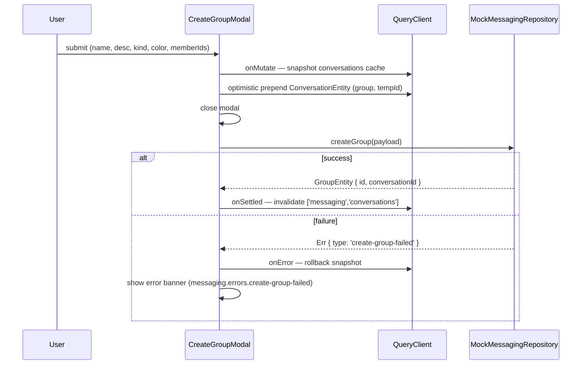

# State Design — US-E10.4 Messaging Enhancements (DR-008)

**Author**: fe-state-engineer  
**Status**: complete — ready for fe-nextjs-engineer  
**Extends**: US-E10.1 base messaging (implemented)  
**Service**: `social` — mock-first (decision 0014, 0017)  
**No global store introduced.** All state is TanStack Query (server state), `useState` (local UI), or `react-hook-form + zod` (form state).

---

## 1. State Architecture Summary

### What is NEW in US-E10.4 (additive only)

US-E10.1 established:
- `['messaging','conversations']` query via RSC initial data + TanStack Query client hydration
- `['messaging','messages', conversationId]` infinite query
- `['messaging','contacts']` query
- Server Actions for `sendMessage`, `createConversation`

US-E10.4 adds on top:

| Category | Addition |
|---|---|
| New query key | `['messaging','group', groupId]` — GroupEntity (members + pinnedMessages) |
| Extended entities | MessageEntity gains `replyTo`, `isPinned`, `isDeleted`, `sentAt`; ConversationEntity gains `lastSenderName` |
| 8 new mutations | createGroup, updateGroup, addMembers, removeMember, leaveGroup, deleteGroup, pinMessage, deleteMessage |
| 3 optimistic updates | createGroup (prepend), pinMessage (set flag), deleteMessage (soft-delete) |
| Local UI state (11 atoms) | Modal open/step, form, selected members, context menu, reply strip, group info panel open/edit/confirm |

### Key decisions

1. **No Server Actions for social mutations** — all 8 mutations dispatch directly from client components to the mock repository via TanStack Query `useMutation`. The mock repository is in-memory; no `'use server'` boundary is needed until the real `social` service ships. This is consistent with the mock-first pattern (decision 0014).

2. **GroupInfoPanel fetches client-side** — `['messaging','group', groupId]` is a client TanStack Query (`useQuery`), NOT RSC-fetched. The panel opens dynamically after user interaction; SSR prefetch would be wasted for most page loads. The panel shows a skeleton during its own fetch.

3. **MessagingScreen RSC boundary unchanged** — `app/[locale]/(dashboard)/messages/page.tsx` still fetches `initialConversations` + `initialContacts` server-side and passes them as the `MessagingScreenVM`. The client hydrates TanStack Query from this initial data. US-E10.4 adds no new RSC-fetched data.

4. **SSE invalidation hook point** — decision 0009 SSE proxy. When `social` emits group-update events (`group.member_added`, `group.member_removed`, `group.message_pinned`), the SSE handler calls `queryClient.invalidateQueries({ queryKey: messagingKeys.group(groupId) })`. Wire the invalidation call now; leave SSE source mocked.

---

## 2. State Inventory

| # | State item | Type | Owner | TS shape | Reason |
|---|---|---|---|---|---|
| 1 | Conversation list (incl. groups) | Server state | TanStack Query | `ConversationEntity[]` | Already exists; groups tab filters `type==='group'` |
| 2 | Messages for active conversation | Server state | TanStack Query infinite | `InfiniteData<MessagePage>` | Already exists; entity extended with `replyTo/isPinned/isDeleted/sentAt` |
| 3 | Contacts list | Server state | TanStack Query | `ContactEntity[]` | Already exists; reused by step 2 member search |
| 4 | Group detail (members + pinned) | Server state | TanStack Query | `GroupEntity` | NEW — fetched when GroupInfoPanel opens |
| 5 | createGroupModal open | Local UI | `ConversationList` or `MessagingScreen` | `boolean` | Controls Radix Dialog open state |
| 6 | createGroupModal current step | Local UI | `CreateGroupModal` internal | `1 \| 2` | Step navigation within modal |
| 7 | Step 1 form values | Local form | `CreateGroupModal` internal (`useForm`) | `CreateGroupStep1Fields` (see §6) | react-hook-form + zod; not shared outside modal |
| 8 | Step 2 selected member IDs | Local UI | `CreateGroupModal` internal | `string[]` | Chip area + list checkbox sync; no server state needed |
| 9 | Step 2 member search query | Local UI | `CreateGroupModal` internal | `string` | Filters `contacts` query client-side; no separate fetch |
| 10 | Context menu open | Local UI | `ChatWindow` | `boolean` | Drives Radix or custom menu visibility |
| 11 | Context menu position | Local UI | `ChatWindow` | `{ x: number; y: number }` | Viewport-clamped pixel position from click/long-press event |
| 12 | Context menu target message ID | Local UI | `ChatWindow` | `string \| null` | Which message the menu acts on |
| 13 | Reply state | Local UI | `ChatWindow` or `MessagingScreen` | `ReplyState \| null` (see §2a) | Drives ReplyStrip visibility + populates `replyTo` on send |
| 14 | Group info panel open | Local UI | `ChatWindow` | `boolean` | Slide-in panel visibility |
| 15 | Group info panel groupId | Local UI | `ChatWindow` | `string \| null` | Which group the panel shows; drives `useQuery` inside panel |
| 16 | Group info panel edit mode | Local UI | `GroupInfoPanel` internal | `boolean` | Admin-only: toggles inline inputs |
| 17 | Delete group confirm visible | Local UI | `GroupInfoPanel` internal | `boolean` | Inline two-step confirm in footer |
| 18 | Leave group confirm dialog open | Local UI | `GroupInfoPanel` internal | `boolean` | Separate confirmation dialog (TR-013) |
| 19 | Delete message confirm dialog open | Local UI | `ChatWindow` | `boolean` | alertdialog before executing deleteMessage mutation |
| 20 | Delete message target ID | Local UI | `ChatWindow` | `string \| null` | Which message the delete dialog acts on |
| 21 | Highlighted message ID (scroll target) | Local UI | `ChatWindow` | `string \| null` | 3s CSS highlight after scroll-to-pinned; cleared after timeout |

**2a — ReplyState shape:**
```ts
type ReplyState = {
  messageId: string;
  senderName: string;
  excerpt: string;
};
```

---

## 3. State Flow

### 3a — RSC to Client (initial load, unchanged from E10.1)

```
app/messages/page.tsx (RSC)
  └── makeGetConversationsUseCase() → ConversationEntity[]
  └── makeGetContactsUseCase()      → ContactEntity[]
  └── Maps to MessagingScreenVM { initialConversations, initialContacts, loadError? }
  └── Props to <MessagingScreen vm={...} />
        └── Client: hydrates ['messaging','conversations'] + ['messaging','contacts']
              via queryClient.setQueryData() in useEffect or HydrationBoundary
```

Groups tab: client filters `initialConversations.filter(c => c.type === 'group')` — no new RSC fetch.

### 3b — GroupInfoPanel (NEW client-only query path)

```
User clicks group name in ChatWindow header
  → setChatWindowState({ groupInfoPanelOpen: true, groupInfoPanelGroupId: groupId })
  → GroupInfoPanel mounts with groupId prop
  → useQuery({ queryKey: messagingKeys.group(groupId), ... })
       → skeleton while loading
       → GroupEntity rendered (members + pinned)
```

### 3c — Mutation flow (all client-side, mock-first)

```
User action (e.g., submits CreateGroupModal)
  → useMutation.mutate(payload)
  → onMutate: snapshot cache, apply optimistic update
  → Server Action / mock repository called
  → onError: rollback from snapshot
  → onSettled: queryClient.invalidateQueries(keys)
```

### 3d — SSE → invalidation (wire now, mock source)

```
SSE event: { type: 'group.member_added' | 'group.member_removed' | 'group.message_pinned', groupId }
  → queryClient.invalidateQueries({ queryKey: messagingKeys.group(groupId) })

SSE event: { type: 'group.deleted' | 'group.left', conversationId }
  → queryClient.invalidateQueries({ queryKey: messagingKeys.conversations() })
```

### 3e — Mermaid: createGroup optimistic flow



---

## 4. Query Key Hierarchy + Cache Policy

### Key factory (extend existing `messagingKeys`)

```ts
// src/features/messaging/presentation/messaging-query-keys.ts
export const messagingKeys = {
  all:           () => ['messaging'] as const,
  conversations: () => ['messaging', 'conversations'] as const,
  messages:      (conversationId: string) => ['messaging', 'messages', conversationId] as const,
  contacts:      () => ['messaging', 'contacts'] as const,
  // NEW in US-E10.4:
  group:         (groupId: string) => ['messaging', 'group', groupId] as const,
} as const;
```

### Cache policy per key

| Query key | `staleTime` | `gcTime` | `refetchOnWindowFocus` | Notes |
|---|---|---|---|---|
| `conversations()` | 30 s | 5 min | true | Short stale — groups list should feel live |
| `messages(convoId)` | 10 s | 5 min | false | Infinite query; SSE-driven refresh preferred |
| `contacts()` | 5 min | 10 min | false | Rarely changes; used for member search |
| `group(groupId)` | 30 s | 5 min | true | Panel data; invalidated by group mutations + SSE |

### `useQuery` for `group(groupId)`

```
queryKey: messagingKeys.group(groupId)
queryFn:  () => getGroupInfoAction(groupId)  // Server Action wrapping UC-GET-GROUP-INFO
enabled:  groupId !== null
staleTime: 30_000
gcTime:    300_000
```

`getGroupInfoAction` is a `'use server'` action calling `makeGetGroupInfoUseCase()`. It returns `{ ok: true, value: GroupEntity } | { ok: false, errorKey: MessagingFailure['type'] }`. On `ok: false`, the `queryFn` throws so TanStack Query enters error state.

---

## 5. Invalidation Map

| Trigger | Mutation / Event | Keys invalidated | Notes |
|---|---|---|---|
| `createGroup` succeeds | `useMutation` `onSettled` | `messagingKeys.conversations()` | Replaces optimistic entry with server-confirmed entity |
| `createGroup` fails | `useMutation` `onError` | none (rollback only) | Snapshot restored, no invalidation |
| `updateGroup` succeeds | `useMutation` `onSettled` | `messagingKeys.group(groupId)` | Refreshes panel header + member list |
| `addMembers` succeeds | `useMutation` `onSettled` | `messagingKeys.group(groupId)` | New members appear in panel |
| `removeMember` succeeds | `useMutation` `onSettled` | `messagingKeys.group(groupId)` | Removed member row disappears |
| `leaveGroup` succeeds | `useMutation` `onSettled` | `messagingKeys.conversations()` | Group disappears from list |
| `deleteGroup` succeeds | `useMutation` `onSettled` | `messagingKeys.conversations()` | Group disappears from list |
| `pinMessage` succeeds | `useMutation` `onSettled` | `messagingKeys.group(groupId)`, `messagingKeys.messages(conversationId)` | Pinned list in panel + `isPinned` on message |
| `deleteMessage` succeeds | `useMutation` `onSettled` | `messagingKeys.messages(conversationId)` | Confirms optimistic `isDeleted: true` |
| `deleteMessage` fails | `useMutation` `onError` | none (rollback only) | Snapshot restored |
| SSE `group.member_added` | realtime event | `messagingKeys.group(groupId)` | Another user added a member |
| SSE `group.member_removed` | realtime event | `messagingKeys.group(groupId)` | Another user removed a member |
| SSE `group.message_pinned` | realtime event | `messagingKeys.group(groupId)` | Another admin pinned a message |
| SSE `group.deleted` | realtime event | `messagingKeys.conversations()` | Group was deleted by admin |

---

## 6. Mutations and Optimistic Strategy

All mutations live in client components. No Server Actions for group lifecycle mutations (mock-first, no auth cookie required for mock). When the real `social` service ships, the `queryFn`/`mutationFn` implementations will swap to call Server Actions — the key hierarchy and invalidation map do not change.

### M1 — `createGroup`

**Hook location**: `CreateGroupModal`

```
onMutate(payload):
  1. await queryClient.cancelQueries({ queryKey: messagingKeys.conversations() })
  2. snapshot = queryClient.getQueryData(messagingKeys.conversations())
  3. Build optimistic ConversationEntity:
       { id: `optimistic-${Date.now()}`, type: 'group', name: payload.name,
         avatarInitials: computeInitials(payload.name),
         color: payload.color, lastMessage: '', lastMessageTime: '',
         unreadCount: 0, memberCount: payload.memberIds.length + 1,
         lastSenderName: undefined }
  4. queryClient.setQueryData(conversations(), [optimistic, ...existing])
  5. return { snapshot }

onError(err, vars, context):
  queryClient.setQueryData(conversations(), context.snapshot)
  show error banner: t('messaging.errors.create-group-failed')

onSettled:
  queryClient.invalidateQueries({ queryKey: messagingKeys.conversations() })
```

**After success**: close modal, clear form, reset step to 1, clear selectedMembers.

---

### M2 — `updateGroup`

**Hook location**: `GroupInfoPanel` (edit mode Save button)

No optimistic update — the panel is already showing the live form values as the user types. The save triggers a refetch via invalidation.

```
onMutate: none
onError(err):
  show inline error in panel header: t('messaging.errors.group-mutation-failed')
  revert inputs to pre-edit values (local state reset)

onSettled:
  queryClient.invalidateQueries({ queryKey: messagingKeys.group(groupId) })
  setEditMode(false)
```

---

### M3 — `addMembers`

**Hook location**: `GroupInfoPanel` (add-member inline search confirm)

No optimistic update — member list consistency requires server truth.

```
onError:
  show inline banner: t('messaging.errors.group-mutation-failed')

onSettled:
  queryClient.invalidateQueries({ queryKey: messagingKeys.group(groupId) })
```

---

### M4 — `removeMember`

**Hook location**: `GroupInfoPanel` (member row remove button)

```
onMutate(payload):
  1. snapshot = queryClient.getQueryData(messagingKeys.group(groupId))
  2. Optimistically remove member from GroupEntity.members:
       queryClient.setQueryData(group(groupId), old =>
         ({ ...old, members: old.members.filter(m => m.userId !== payload.userId) }))
  3. return { snapshot }

onError(err, vars, context):
  queryClient.setQueryData(group(groupId), context.snapshot)
  show inline banner: t('messaging.errors.group-mutation-failed')

onSettled:
  queryClient.invalidateQueries({ queryKey: messagingKeys.group(groupId) })
```

---

### M5 — `leaveGroup`

**Hook location**: Leave confirm dialog (inside `GroupInfoPanel`)

No optimistic on panel-level. After leave:
- Close GroupInfoPanel
- Close confirm dialog
- Invalidate conversations (group disappears)

```
onError:
  show toast/banner: t('messaging.errors.leave-group-failed')

onSettled:
  queryClient.invalidateQueries({ queryKey: messagingKeys.conversations() })
  setGroupInfoPanelOpen(false)
```

---

### M6 — `deleteGroup`

**Hook location**: Inline two-step confirm footer in `GroupInfoPanel`

```
onError:
  show inline error in footer: t('messaging.errors.group-mutation-failed')
  reset deleteGroupConfirm to false

onSettled:
  queryClient.invalidateQueries({ queryKey: messagingKeys.conversations() })
  setGroupInfoPanelOpen(false)
  // navigate away from group conversation if active
```

---

### M7 — `pinMessage`

**Hook location**: `ChatWindow` (dispatched from context menu action)

```
onMutate({ conversationId, messageId, groupId }):
  1. snapshot = queryClient.getQueryData(messagingKeys.messages(conversationId))
  2. Optimistically set isPinned: true on the target message:
       queryClient.setQueryData(messages(conversationId), old =>
         updateInfinitePages(old, msg =>
           msg.id === messageId ? { ...msg, isPinned: true } : msg))
  3. return { snapshot, conversationId }

onError(err, vars, context):
  queryClient.setQueryData(messages(context.conversationId), context.snapshot)
  show error banner: t('messaging.errors.pin-failed')

onSettled({ conversationId, groupId }):
  queryClient.invalidateQueries({ queryKey: messagingKeys.group(groupId) })
  queryClient.invalidateQueries({ queryKey: messagingKeys.messages(conversationId) })
```

**Note**: `updateInfinitePages` is a local utility that maps over `InfiniteData<MessagePage>` pages — it is not implementation code, just the update pattern description.

---

### M8 — `deleteMessage`

**Hook location**: `ChatWindow` (dispatched after alertdialog confirm)

```
onMutate({ conversationId, messageId }):
  1. snapshot = queryClient.getQueryData(messagingKeys.messages(conversationId))
  2. Optimistically soft-delete the message:
       queryClient.setQueryData(messages(conversationId), old =>
         updateInfinitePages(old, msg =>
           msg.id === messageId
             ? { ...msg, isDeleted: true, text: '' }  // text cleared; presentation renders deletedLabel
             : msg))
  3. return { snapshot, conversationId }

onError(err, vars, context):
  queryClient.setQueryData(messages(context.conversationId), context.snapshot)
  show error banner: t('messaging.errors.delete-message-failed')

onSettled({ conversationId }):
  queryClient.invalidateQueries({ queryKey: messagingKeys.messages(conversationId) })
```

**Presentation rendering rule**: When `msg.isDeleted === true`, `ChatBubble` ignores `msg.text` and renders `t('messaging.deleteDialog.deletedLabel')` in muted-italic style, regardless of the text field value. The `text: ''` in the optimistic update is a safety net — the presentation-layer rendering condition is the canonical gate.

---

## 7. Async State Machine

### 7a — Conversation list (existing + groups tab)

| State | Condition | UI treatment |
|---|---|---|
| Loading | `isLoading && !initialConversations` | Shimmer skeleton list (5 rows, alternating avatar + text lines) |
| Error | `isError` | Error banner: `t('messaging.errors.load-conversations-failed')` + retry button (only when `error.retryable === true`) |
| Empty (groups tab) | `groups.length === 0` | Empty state: users icon (36px, `var(--edu-border)`), `t('messaging.group.emptyTitle')`, `t('messaging.group.emptySubtitle')`, primary CTA `t('messaging.group.emptyCreateCta')` → opens CreateGroupModal |
| Stale / refetching | `isFetching && !isLoading` | Subtle refetch indicator (no spinner blocker); list remains interactive |
| Success | `data && !isLoading` | Render ConversationItem list; groups filtered + sorted by `lastMessageTime` |

### 7b — GroupInfoPanel (`useQuery` for `group(groupId)`)

| State | Condition | UI treatment |
|---|---|---|
| Loading | `isLoading` | Skeleton: avatar circle (80×80) + 3 shimmer lines (name, desc, members count) + member row skeletons |
| Error | `isError` | Error message inline in panel body: failure key → `t('messaging.errors.group-mutation-failed')` |
| Success | `data` | Full panel: header, avatar, members section, pinned section, footer |

Failure key mapping for group info fetch error:

| `error.code` (API) | `MessagingFailure.type` | i18n key |
|---|---|---|
| `GROUP_NOT_FOUND` | `group-mutation-failed` | `messaging.errors.group-mutation-failed` |
| `NOT_GROUP_MEMBER` | `group-mutation-failed` | `messaging.errors.group-mutation-failed` |
| network / unknown | `group-mutation-failed` | `messaging.errors.group-mutation-failed` |

### 7c — Message list (existing infinite query, extended entity)

| State | Condition | UI treatment |
|---|---|---|
| Loading | `isLoading` | 5 staggered shimmer bubbles (alternating left/right, 28px height, shimmer gradient animation — not motion-gated per TR-023) |
| Load more | `isFetchingNextPage` | Subtle spinner above existing messages |
| Error | `isError` | Error banner: `t('messaging.errors.load-messages-failed')` + retry |
| Empty | `pages[0].messages.length === 0` | Empty conversation state (existing) |
| Success | normal | Render ChatBubble list; `isDeleted` → deleted placeholder; `isPinned` → star marker; `replyTo` → quoted block |

### 7d — Mutation async states (inline feedback)

| Mutation | Pending | Success | Error |
|---|---|---|---|
| `createGroup` | Optimistic item with loading indicator in group list | Confirmed item (real ID) | Rollback + error banner under modal close |
| `updateGroup` | Save button `isPending` state (disabled + spinner) | Panel refreshes, editMode closes | Inline error in panel, inputs revert |
| `addMembers` | Add button `isPending` | Member list refreshes | Inline error |
| `removeMember` | Optimistic row removal | Confirmed | Rollback row + inline error |
| `leaveGroup` | Confirm button `isPending` | Panel closes, list updates | Toast error |
| `deleteGroup` | Confirm button `isPending` | Panel closes, list updates | Inline footer error, confirm resets |
| `pinMessage` | Optimistic `isPinned` on bubble | Pinned list updates | Rollback + banner |
| `deleteMessage` | Optimistic deleted placeholder | Confirmed | Rollback + banner |

### 7e — Error key → i18n path mapping (complete for E10.4)

```
MessagingFailure.type                  → messaging.errors.<type>
---------------------------------------------------------------
'load-conversations-failed'            → messaging.errors.load-conversations-failed
'load-messages-failed'                 → messaging.errors.load-messages-failed
'send-message-failed'                  → messaging.errors.send-message-failed
'create-conversation-failed'           → messaging.errors.create-conversation-failed
'create-group-failed'   (NEW)          → messaging.errors.create-group-failed  [ADD key]
'group-mutation-failed' (NEW)          → messaging.errors.group-mutation-failed [ADD key]
'leave-group-failed'    (NEW)          → messaging.errors.leave-group-failed    [ADD key]
'pin-failed'            (NEW)          → messaging.errors.pin-failed            [ADD key]
'delete-message-failed' (NEW)          → messaging.errors.delete-message-failed [ADD key]
'not-group-admin'       (NEW)          → messaging.errors.not-group-admin       [ADD key]
```

**Action for fe-nextjs-engineer**: The spec states 47 keys are pre-staged in `vi.json`/`en.json`. The `messaging.errors.*` keys for E10.4 failures are NOT yet in the file (checked — only `create-conversation-failed`, `load-conversations-failed`, `load-messages-failed`, `send-message-failed` exist). Add all 6 new error keys to BOTH `vi.json` and `en.json` simultaneously before implementing error states. Values are the friendly Vietnamese messages — suggest adding them as:
- `create-group-failed`: "Không thể tạo nhóm. Vui lòng thử lại."
- `group-mutation-failed`: "Cập nhật nhóm không thành công. Vui lòng thử lại."
- `leave-group-failed`: "Không thể rời nhóm. Vui lòng thử lại."
- `pin-failed`: "Không thể ghim tin nhắn. Vui lòng thử lại."
- `delete-message-failed`: "Không thể xoá tin nhắn. Vui lòng thử lại."
- `not-group-admin`: "Bạn không có quyền thực hiện thao tác này."

---

## 8. Race Conditions and Resolution

### R1 — Concurrent `createGroup` submits (double-tap)

**Risk**: User taps "Tạo nhóm" twice before the first response. Two optimistic entries prepend; two API calls fire.

**Resolution**: Disable the submit button for the duration of `isPending` state (`useMutation` exposes this). The second tap hits a disabled button and is ignored. No additional de-duplication needed.

---

### R2 — `removeMember` optimistic vs. SSE `group.member_removed` arriving simultaneously

**Risk**: Admin removes member X. Optimistic update removes X from cache. Meanwhile SSE delivers `group.member_removed` for X (from another admin). Both paths remove X; `onSettled` invalidate then re-fetches a list that no longer contains X. Result: member row flickers (removed → refetch confirms removal).

**Resolution**: No special handling needed. Both paths converge on the same truth (X not in members). The flicker is imperceptible at normal network speed. `onSettled` invalidation triggers one refetch that settles state correctly.

---

### R3 — `deleteMessage` optimistic vs. `refetchOnWindowFocus`

**Risk**: User soft-deletes message (optimistic `isDeleted: true`). Before `onSettled` fires, the window loses and regains focus, triggering `refetchOnWindowFocus`. The refetch could re-render the original (non-deleted) message from stale server data.

**Resolution**: The `deleteMessage` `onMutate` calls `cancelQueries` for `messages(conversationId)` before setting the optimistic value. This cancels any in-flight refetch. After `onSettled` the invalidation triggers a fresh fetch that confirms `isDeleted: true` from the mock.

---

### R4 — `pinMessage` on a message already being sent (isPending optimistic)

**Risk**: User right-clicks a message bubble that has `isPending: true` (send in flight) and attempts to pin it. The message doesn't have a real `id` yet (it has a local temp ID).

**Resolution**: Disable the context menu trigger on messages where `isPending === true`. The right-click handler checks `msg.isPending` and returns early (no menu opens). This is enforced at the presentation boundary — state design makes `isPending` available on `MessageEntity`.

---

### R5 — `leaveGroup` or `deleteGroup` while GroupInfoPanel query is in flight

**Risk**: User opens GroupInfoPanel (group query starts) and immediately clicks "Rời nhóm". The mutation completes, invalidates `conversations()`, navigates away. Meanwhile the group query resolves and tries to update a now-stale cache entry for a group the user no longer belongs to.

**Resolution**: `leaveGroup`/`deleteGroup` `onSettled` calls `queryClient.removeQueries({ queryKey: messagingKeys.group(groupId) })` in addition to invalidating conversations. This prevents a stale `GroupEntity` from persisting in cache after the user has left/deleted the group. `GroupInfoPanel` will unmount on navigation, and its `useQuery` will be garbage-collected within `gcTime`.

---

### R6 — Multiple rapid `updateGroup` saves (admin edits name quickly)

**Risk**: Admin types fast and clicks Save multiple times before the first PATCH returns. Multiple concurrent PATCH requests may return out of order; the later response could overwrite the earlier one incorrectly.

**Resolution**: The Save button is disabled while `useMutation` `isPending`. Only one PATCH fires at a time. On `onSettled`, edit mode closes and the query invalidates. A second edit requires re-entering edit mode — this naturally serializes saves.

---

## 9. React-hook-form + Zod Schema (CreateGroupModal Step 1)

```ts
// src/features/messaging/presentation/create-group-modal/create-group-modal.i-vm.ts

import { z } from 'zod';

export const GROUP_KINDS = ['class', 'dept', 'club', 'other'] as const;
export type GroupKind = typeof GROUP_KINDS[number];

export const GROUP_COLORS = [
  'primary',   // var(--edu-primary) — #5D87FF
  'success',   // var(--edu-success) — #13DEB9
  'warning',   // var(--edu-warning) — #FFAE1F
  'error',     // var(--edu-error)   — #FA896B
  'purple',    // var(--edu-purple)  — #7B5EA7
  'teal',      // var(--edu-teal)    — #00B8A9
  'indigo',    // #6366F1 — requires token or raw in color calc only
  'orange',    // #FB923C — requires token or raw in color calc only
] as const;
export type GroupColor = typeof GROUP_COLORS[number];

export const createGroupStep1Schema = z.object({
  name: z
    .string()
    .min(2, { message: 'messaging.group.nameLabel' })   // i18n key; presentation calls t()
    .max(60, { message: 'messaging.group.nameLabel' }),
  description: z
    .string()
    .max(140)
    .optional()
    .or(z.literal('')),
  kind: z.enum(GROUP_KINDS),
  color: z.enum(GROUP_COLORS),
});

export type CreateGroupStep1Fields = z.infer<typeof createGroupStep1Schema>;

export const createGroupStep1Defaults: CreateGroupStep1Fields = {
  name: '',
  description: '',
  kind: 'class',
  color: 'primary',
};
```

**Validation behavior** (aligns with TR-004, AC-002-1):
- `name` validates on `blur` and on "Tiếp theo" button click attempt
- "Tiếp theo" button is disabled when `!isValid || name.length < 2` (react-hook-form `formState.isValid`)
- `description` is optional; empty string normalizes to `undefined` before submission
- `kind` defaults to `'class'` (first radio option pre-selected)
- `color` defaults to `'primary'` (first swatch pre-selected)

**Note on indigo/orange**: These two colors (`#6366F1`, `#FB923C`) are not currently in `src/app/tokens.css` as named semantic tokens. They are design-spec swatches from the 8-swatch palette (spec §3 TR-003). If the engineer resolves them via CSS custom property references rather than class utilities (e.g., `style={{ backgroundColor: '#6366F1' }}`), no new token ADR is needed for the swatch background only. If Tailwind class usage is needed, flag to `fe-lead` for an ADR before adding raw tokens.

---

## 10. RSC / Client Boundary Summary

| Data | Fetched where | Mechanism | Notes |
|---|---|---|---|
| `initialConversations` | RSC (`page.tsx`) | `makeGetConversationsUseCase()` | Unchanged from E10.1; includes group conversations |
| `initialContacts` | RSC (`page.tsx`) | `makeGetContactsUseCase()` | Unchanged; reused for member search in CreateGroupModal step 2 |
| Group detail (members + pinned) | Client | `useQuery(messagingKeys.group(groupId))` via Server Action | Fetched on demand when GroupInfoPanel opens |
| All mutations | Client | `useMutation` calling mock repository (mock-first) | No Server Actions for writes until `social` service ships |
| Messages (infinite scroll) | Client | `useInfiniteQuery(messagingKeys.messages(convoId))` via Server Action | Unchanged from E10.1; entity extended |

**No Server Actions are added for mutations in US-E10.4.** The existing pattern (`getMessagesAction`, `sendMessageAction`) uses Server Actions because the mock repository is `'server-only'`. The 8 new mutation use cases will follow the same pattern when implemented — each will have a corresponding `'use server'` action in `app/[locale]/(dashboard)/messages/actions.ts`. The `mutationFn` in `useMutation` calls these actions.

---

## 11. ViewModel Additions

`MessagingScreenVM` does NOT change its shape for E10.4. The existing `{ initialConversations, initialContacts, loadError? }` contract is sufficient — group conversations are already in `initialConversations` via the `type === 'group'` field.

`CreateGroupModal` gets a new `create-group-modal.i-vm.ts` with:
- `CreateGroupStep1Fields` (Zod schema type, see §9)
- `GroupKind`, `GroupColor` union types

`GroupInfoPanel` gets a new `group-info-panel.i-vm.ts` with:
- `GroupInfoPanelVM` interface:
  ```ts
  interface GroupInfoPanelVM {
    groupId: string;
    selfIsAdmin: boolean;  // derived from GroupEntity.members.find(m => m.userId === currentUserId)?.role === 'admin'
  }
  ```
- The panel fetches `GroupEntity` itself via `useQuery` — the ViewModel prop carries only the groupId and admin status (which is rechecked after fetch).

---

## 12. Open Items Flagged for fe-lead

1. **6 new error i18n keys needed** — `messaging.errors.{create-group-failed, group-mutation-failed, leave-group-failed, pin-failed, delete-message-failed, not-group-admin}` are not in `vi.json`/`en.json`. Pre-staged 47 keys do not include the error namespace entries for new failures. Add before implementing error states.

2. **indigo/orange swatch tokens** — the 8-color palette includes `#6366F1` and `#FB923C` which are not named tokens in `src/app/tokens.css`. If Tailwind class utilities are needed for these colors (beyond inline style for avatar background), an ADR is required. Recommend using `style={{ backgroundColor: ... }}` inline for the swatch backgrounds only (this is the computed/dynamic use case exempted by `.claude/rules/tailwind-v4.md`).

3. **SSE event taxonomy** — decision 0009 covers SSE infrastructure. The event names used above (`group.member_added`, `group.member_removed`, `group.message_pinned`, `group.deleted`) are assumed. Confirm with `fe-lead` whether these match the SSE event schema defined in the realtime decision or if they need to be registered in `bootstrap/realtime`.

4. **Unpin MVP scope** — INT-009 (unpin) is defined in spec §14 open item 1. No state design is provided for unpin in this document. If unpin is added to the context menu for a future US, the invalidation map entry is: invalidate `messagingKeys.group(groupId)` + `messagingKeys.messages(conversationId)`, with the same optimistic flip pattern as `pinMessage` but `isPinned: false`.
