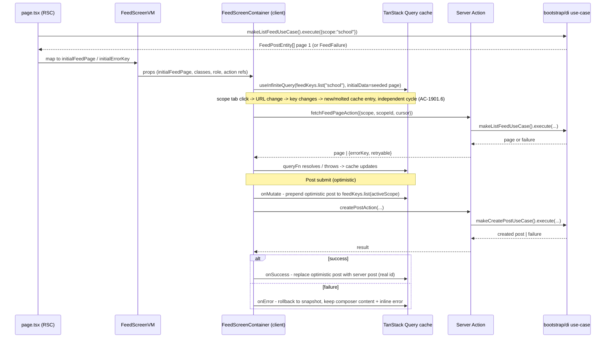

# US-E19.1 — Social Feed — State Architecture

Author: `fe-state-engineer`. No production code in this file — a design for
`fe-nextjs-engineer` to implement directly against, per `plan.md` Phase 2/3/5/6.
Mirrors the established conventions already in this codebase: query-key
factory + `ThrownFailure{type,retryable}` + `retry: (n,err) => isRetryable(err) && n<2`
from `moderation-screen.tsx`, and the `useInfiniteQuery` + optimistic
`setQueryData` prepend shape from `notifications-center-container.tsx`. No
Zustand/global store — server state via TanStack Query, tab/scope via URL
search params, composer/comment inputs via local component state (plain
controlled inputs are enough here; this story has no multi-field form needing
`react-hook-form`/`zod` — single-textarea composer and single-textarea comment
input, validated inline against the 422 failure union, not a client-side
schema).

---

## 1. State Architecture Summary

- **Server state (TanStack Query):** feed list (per scope, `useInfiniteQuery`),
  comment thread (per post, `useQuery` single-page — see §3), reaction toggle
  (`useMutation`, optimistic), post submit (`useMutation`, optimistic prepend),
  add-comment (`useMutation`, optimistic append — not required by AC but
  matches the "appends immediately" wording of AC-1904.4 without extra cost),
  pin/unpin (`useMutation` with **no `mutationFn` HTTP call** — pure
  `setQueryData`, see §6.3), remove-content (`useMutation`, **never
  optimistic**, mirrors `moderation-screen.tsx`'s established convention).
- **URL state:** active scope tab (`scope=school|class`) + active `classId`
  when scope=class. Decision: promote to URL searchParam (§10) — not required
  by any of the 44 AC, but consistent with this repo's established convention
  (`moderation-screen.tsx` keeps its queue tab+filter in the URL) and the
  Decision Framework table (`tab` → URL state), at near-zero cost.
- **Local state:** composer textarea value + attach-mock-image toggle, comment
  input value per expanded thread, expanded/collapsed thread `Set<postId>`,
  confirm-dialog open + captured remove-vars (mirrors `moderation-screen.tsx`'s
  `removeVars` capture-at-open-time pattern), report-dialog open + captured
  report target.
- **RSC↔client split:** `page.tsx` resolves role/tenant/user's-class-list
  (existing session/role resolution, no new work) and seeds **page 1 of the
  default scope's feed** as `initialData` for the client's `useInfiniteQuery`
  (same `queueInitialData`-with-filter-match-guard shape as
  `moderation-screen.tsx` lines 130–149) — everything else (scope switches,
  load-more, comments, mutations) is client-owned query/mutation state.
- **Key decisions requiring `fe-lead` awareness (not ADR-tier, but flagged):**
  1. Scope-tab/classId → URL searchParams (§10).
  2. Stale-tab-switch guard → rely on TanStack Query's automatic
     query-key-change behavior, no explicit `AbortController` (§2).
  3. Comment list → single-page `useQuery`, confirming plan.md's default (§3).
  4. Remove entry point → invalidate-only (never optimistic), confirming the
     established `moderation-screen.tsx` convention applies here too (§7).
  5. Pin/unpin → `useMutation` with a no-op `mutationFn` (local-only,
     `setQueryData`-driven), not a plain `useReducer` outside Query (§6.3) —
     rationale below.
  6. **Resolved: ADR 0052** (`docs/decisions/0052-moderate-delete-reportid-optional.md`).
     `IModerationRepository.removeContent()`'s `RemoveContentRepoInput.reportId`
     was a **required** field (`i-moderation.repository.ts` line 44–56);
     `moderation-screen.tsx` always has a `reportId` in scope (report queue),
     but feed's Remove menu item acts directly on a post/comment with no
     prior report. ADR 0052 makes `reportId` optional — feed omits it. See §7
     for the resolved mutation shape; `ModerationRepository`/
     `MockModerationRepository`'s optional-handling tweak is now a Phase-5
     `fe-nextjs-engineer` implementation task, not a design blocker.

---

## 2. State Inventory

| # | State | Type | Owner | Shape (TS) | Reason |
| --- | --- | --- | --- | --- | --- |
| 1 | Feed list (school or class, paginated) | Server (infinite query) | `feed-screen-container.tsx` | `InfiniteData<FeedListPage>` where `FeedListPage = { posts: FeedPostEntity[]; nextCursor: string \| null; hasMore: boolean }` | Cursor-paginated remote list; independent cache entry per scope so tab switch = independent loading cycle (AC-1901.6) |
| 2 | Comment thread (per post) | Server (query) | `feed-comments.tsx` | `{ comments: FeedCommentEntity[]; nextCursor: string \| null; hasMore: boolean }` (single-page consumption for now, see §3) | Expand-on-demand fetch, sub-section states (AC-1904.1/.2) |
| 3 | Reaction toggle in-flight | Server (mutation) | `feed-reaction-bar.tsx` | mutation vars `{ postId: string; nextReaction: ReactionType \| null }` | Optimistic PUT/DELETE against reactions (FR-004) |
| 4 | Post submit in-flight | Server (mutation) | `feed-composer.tsx` | mutation vars `{ scope: "school"\|"class"; scopeId?: string; content: string; attachmentUrl?: string }` | Optimistic prepend (FR-003) |
| 5 | Add-comment in-flight | Server (mutation) | `feed-comments.tsx` | mutation vars `{ postId: string; content: string }` | Optimistic append (AC-1904.4) |
| 6 | Pin/unpin toggle | Server-cache-shaped, but **local-only, no HTTP** (mutation with no-op `mutationFn`) | `feed-menu.tsx` (trigger) / cache owned by `feed-screen-container.tsx` | mutation vars `{ postId: string; nextPinned: boolean }` | Mock-first (INT-190-07); driving `setQueryData` directly gives it FOR FREE the same re-sort/re-render path as a real mutation, no parallel local reducer to keep in sync (§6.3) |
| 7 | Remove-content in-flight | Server (mutation, never optimistic) | `feed-menu.tsx` (trigger) / `feed-screen-container.tsx` (mutation owner) | mutation vars = `RemoveContentInput` (US-E19.2 shape — see §1 flagged gap) | Delegates to US-E19.2, invalidate-on-success only (FR-012) |
| 8 | Report-content in-flight | Server (mutation, delegated) | `ReportContentDialog`'s own internal submit (US-E19.2) — feed only supplies `reportContentAction` + `isSubmitting`/error props | n/a (US-E19.2 owns the shape) | Feed is a thin pass-through; no feed-list cache interaction (FR-007, confirmed §8) |
| 9 | Active scope tab + classId | URL | `feed-screen-container.tsx` reads via `useSearchParams`, writes via `router.replace` | `?scope=school\|class&classId=<id>` (classId omitted/ignored when scope=school) | Navigational/shareable tab state (§10) |
| 10 | Composer textarea value + mock-attach toggle | Local (component state) | `feed-composer.tsx` | `{ text: string; attachmentUrl?: string }` | Single-field input, not shared, no cross-component read |
| 11 | Comment input value (per expanded thread) | Local (component state) | `feed-comments.tsx` (one instance per post) | `string` | Single-field input, scoped to one thread instance |
| 12 | Expanded-thread set | Local (component state) | `feed-screen` (post-card level) or lifted to container if needed for multiple simultaneous expansions | `Set<postId>` or per-card `boolean` | UI-only expand/collapse, not shareable, not fetched |
| 13 | Confirm-remove dialog open + captured vars | Local (component state) | `feed-screen-container.tsx` (mirrors `moderation-screen.tsx`'s `removeVars` pattern) | `{ open: boolean; vars: RemoveContentInput \| null }` | Captured at open time so a stale click after list mutation can't target the wrong item |
| 14 | Report dialog open + captured target | Local (component state) | `feed-screen-container.tsx` | `{ open: boolean; target: { kind: "post"\|"comment"; contentId: string; authorName: string; preview: string } \| null }` | Same capture-at-open-time reasoning as #13 |

---

## 3. Query Key Hierarchy + Cache Policy

```ts
export const feedKeys = {
  all: () => ["feed"] as const,
  lists: () => [...feedKeys.all(), "list"] as const,
  list: (scope: "school" | "class", classId?: string) =>
    scope === "school"
      ? [...feedKeys.lists(), "school"] as const
      : [...feedKeys.lists(), "class", classId] as const,
  comments: () => [...feedKeys.all(), "comments"] as const,
  commentThread: (postId: string) =>
    [...feedKeys.comments(), postId] as const,
} as const;
```

- **Feed list** (`feedKeys.list(scope, classId)`) — `useInfiniteQuery`.
  - `staleTime: 30_000` (30s — matches `moderation-screen.tsx`'s queue and
    `notifications-center-container.tsx`'s list; feed posts are not
    latency-critical enough to warrant `staleTime: 0`).
  - `gcTime`: default (5 min) — no override needed; scope tabs are cheap to
    refetch and users commonly flip back and forth within a session, so
    keeping the previous scope's cache warm for a few minutes avoids a
    redundant skeleton on tab-back.
  - `refetchOnWindowFocus: false` — matches `moderation-screen.tsx`'s queue
    query; a feed refetching itself out from under an in-progress read/scroll
    on tab focus is worse UX than a slightly stale list (SSE is not in scope
    for real-time freshness here — no `noti` SSE event taxonomy exists for
    `social` feed posts per `integration.md`, this is poll-on-demand only).
  - `retry: (count, err) => isRetryable(err) && count < 2` — identical
    predicate to `moderation-screen.tsx`, driven by the thrown
    `{ type, retryable }` shape from `FeedFailure`/`isRetryableFailure()`.
  - `initialPageParam: null as string | null`, `getNextPageParam: (last) => last.hasMore ? last.nextCursor : undefined`.
  - **RSC seed**: `page.tsx` calls `makeListFeedUseCase()` for the **default
    scope only** (school) and passes the result as `initialData` shaped
    exactly like `moderation-screen.tsx`'s `queueInitialData` — a
    single-page `InfiniteData` — **guarded** by "does the current URL scope
    match the RSC-resolved default scope" (if the user deep-links straight to
    `?scope=class&classId=X`, `initialData` is `undefined` for that key and
    the client fetches normally). This guard is the same pattern as
    `moderation-screen.tsx`'s `filtersEqual(appliedFilter, initialFilter)`
    check — reuse that comparison idiom, don't invent a new one.
- **Comment thread** (`feedKeys.commentThread(postId)`) — `useQuery`
  (single-page, confirming plan.md's default — see rationale below).
  - `enabled: isExpanded` (expand-on-demand, AC-1904.1).
  - `staleTime: 0` — comments are cheap, low-volume, and a thread the user
    just expanded should always show current state (mirrors
    `moderation-screen.tsx`'s detail-sheet `staleTime: 0` reasoning — "always
    fresh" for on-demand, low-traffic detail reads).
  - `retry: (count, err) => isRetryable(err) && count < 2`.
  - **Confirming the single-page default**: `integration.md` explicitly flags
    comment-list pagination as unconfirmed with BE (`[OPEN QUESTION]`).
    Building `useInfiniteQuery` against an endpoint that may not return
    `meta.pagination` at all risks a broken `getNextPageParam` (undefined
    `hasMore`). A single `useQuery` degrades gracefully either way (if BE
    later adds pagination, the query simply doesn't yet expose "load more
    comments" — no crash, no wrong-shape read) and is a strictly safer
    starting point. **Confirmed: keep plan.md's single-page `useQuery`
    default.** When BE confirms `meta.pagination` exists, swap the query hook
    internals only (the key `feedKeys.commentThread(postId)` and the
    component boundary do not change) — this is intentionally the "swap
    point" plan.md already called out.

Cache-policy rationale in one line each: feed list is a shared, revisited
surface → moderate staleness tolerance + no focus-refetch; comment thread is
a low-traffic on-demand detail → always-fresh, no caching benefit worth the
staleness risk.

---

## 4. RSC ↔ Client Boundary

Mirrors `(shared)/messages/page.tsx` + `(shared)/moderation` (via
`moderation-screen.tsx`'s `initialQueuePage`/`initialStats` seeding — same
shape, not the messages screen's simpler "just pass everything as props, no
query seeding" shape, since feed needs infinite-query hydration parity).

```
page.tsx (RSC)
  - resolve: role, tenantId, user's class list [{id,name}] (existing session/role
    resolution — reuse whatever (shared)/messages or (shared)/moderation already
    does, no new resolution logic)
  - read: initial scope+classId from the incoming URL searchParams (Next.js RSC
    receives `searchParams` prop natively — no client-side parse needed for the
    FIRST render)
  - call: makeListFeedUseCase() for that scope ONLY (page 1, cursor=null)
  - map to ViewModel: FeedScreenVM { role, classes, initialScope, initialClassId,
      initialFeedPage (or initialErrorKey), fetchFeedPageAction, createPostAction,
      reactToPostAction, listCommentsAction, addCommentAction, togglePinMockAction,
      reportContentAction, removeContentAction }
  - pass to <FeedScreen {...vm} />

FeedScreen ('use client', presentation — component tree only, no Query)
  -> FeedScreenContainer ('use client', OWNS all TanStack Query + URL search params
      + local dialog/expand state — the ONLY component touching useQuery/
      useInfiniteQuery/useMutation/useSearchParams, exactly like
      moderation-screen.tsx's stated pattern)
```

- **Server Actions** (`actions.ts`, `'use server'`) are the ONLY thing the
  client container calls — never a direct `fetch()`. Each action is a thin
  wrapper: resolve DI factory → `execute()` → map `Result` to
  `{ ok: true; value } | { ok: false; errorKey; retryable }` (matches the
  `ThrownFailure` shape consumed by `queryFn`/`mutationFn` throw-and-catch
  idiom already established in `moderation-screen.tsx`).
- Nothing in `presentation/` imports `infrastructure/` or `bootstrap/di` —
  standard layer boundary, no exception for this feature.

---

## 5. State Flow (mermaid)



---

## 6. Mutations & Optimistic Strategy

All mutations use the established `ThrownFailure { type: FeedFailure["type"]; retryable: boolean }` throw idiom inside `mutationFn`, matching `moderation-screen.tsx`.

### 6.1 Post submit (`createPostAction`, FR-003)

```ts
useMutation({
  mutationFn: async (vars: CreatePostVars) => {
    const res = await createPostAction(vars);
    if (!res.ok) throw { type: res.errorKey, retryable: res.retryable } as ThrownFailure;
    return res.value; // real FeedPostEntity from server
  },
  onMutate: async (vars) => {
    await queryClient.cancelQueries({ queryKey: feedKeys.list(vars.scope, vars.scopeId) });
    const previous = queryClient.getQueryData(feedKeys.list(vars.scope, vars.scopeId));
    const optimisticPost: FeedPostEntity = {
      postId: `optimistic-${crypto.randomUUID()}`, // tempId, never sent to server
      authorId: selfId, authorName, authorRole, authorAvatarUrl,
      scope: vars.scope, classId: vars.scopeId, content: vars.content,
      attachmentUrl: vars.attachmentUrl, createdAt: new Date().toISOString(),
      pinned: false, reactions: { counts: {}, myReaction: null }, commentCount: 0,
    };
    queryClient.setQueryData(feedKeys.list(vars.scope, vars.scopeId), (old: InfiniteFeedData | undefined) => {
      if (!old) return old; // no cache yet (shouldn't happen post-first-load) -> skip optimism
      const [firstPage, ...rest] = old.pages;
      return { ...old, pages: [{ ...firstPage, posts: [optimisticPost, ...firstPage.posts] }, ...rest] };
    });
    return { previous, tempId: optimisticPost.postId };
  },
  onSuccess: (created, vars, ctx) => {
    // Replace the temp-id post with the server-confirmed entity (real id,
    // server createdAt) IN PLACE — do not invalidate/refetch (would lose scroll
    // position and re-trigger a full skeleton for an already-visible list).
    queryClient.setQueryData(feedKeys.list(vars.scope, vars.scopeId), (old: InfiniteFeedData | undefined) => {
      if (!old) return old;
      return {
        ...old,
        pages: old.pages.map((p) => ({
          ...p, posts: p.posts.map((post) => (post.postId === ctx?.tempId ? created : post)),
        })),
      };
    });
    toast.success(t("toasts.postCreated")); // AC-1902.3
  },
  onError: (err, vars, ctx) => {
    // Rollback: remove the optimistic post entirely, restore prior snapshot.
    if (ctx?.previous) queryClient.setQueryData(feedKeys.list(vars.scope, vars.scopeId), ctx.previous);
    // Composer keeps its `text`/`attachmentUrl` local state untouched — the
    // container does NOT clear the composer input on error (AC-1902.5/.6/.7:
    // "content preserved"). The 422/403/transient distinction is read off
    // `err.type`/`err.retryable` by feed-composer.tsx to pick inline copy.
  },
})
```

- `onSettled`: no unconditional invalidate — this mutation touches only ONE
  cache entry it fully owns the shape of (prepend/replace/rollback are
  exhaustive), so a settle-time invalidate would just cause an unnecessary
  refetch. (Contrast with §7's remove-content, which is genuinely
  never-optimistic and DOES invalidate.)
- Race note: if the user submits while a `fetchNextPage` is in flight for the
  SAME key, `cancelQueries` in `onMutate` cancels the in-flight page fetch
  before the optimistic prepend, so the eventual page-fetch resolution can't
  clobber the prepended item (TanStack Query re-applies the cancelled query's
  `select`/merge after the mutation's `setQueryData`, not before — cancel-then-mutate is the standard safe ordering).

### 6.2 Reaction toggle (`reactToPostAction`, FR-004)

Single-active-reaction-per-user semantics: clicking the CURRENT active chip
removes it (DELETE); clicking a DIFFERENT chip replaces it (PUT); clicking
when none is active adds it (PUT).

```ts
useMutation({
  mutationFn: async (vars: { postId: string; nextReaction: ReactionType | null }) => {
    const res = vars.nextReaction === null
      ? await removeReactionAction(vars.postId)
      : await setReactionAction(vars.postId, vars.nextReaction);
    if (!res.ok) throw { type: res.errorKey, retryable: res.retryable } as ThrownFailure;
    return res.value; // updated { counts, myReaction }
  },
  onMutate: async (vars) => {
    await queryClient.cancelQueries({ queryKey: feedKeys.list(activeScope, activeScopeId) });
    const previous = queryClient.getQueryData(feedKeys.list(activeScope, activeScopeId));
    queryClient.setQueryData(feedKeys.list(activeScope, activeScopeId), (old: InfiniteFeedData | undefined) =>
      mapPostInPages(old, vars.postId, (post) => ({
        ...post,
        reactions: applyOptimisticReaction(post.reactions, vars.nextReaction), // pure helper: decrement old myReaction's count, increment new one, set myReaction
      })),
    );
    return { previous };
  },
  onError: (err, vars, ctx) => {
    if (failureType(err) === "post-not-found") {
      // AC-1903.5: rollback the reaction AND remove the post from the list —
      // do NOT just restore `previous` (that would re-show the now-deleted
      // post with its OLD reaction, contradicting "post deleted concurrently").
      // Instead: drop the post from whichever page it currently lives on,
      // computed against `previous` (the pre-optimistic snapshot) since
      // `previous` still has the correct pre-mutation shape.
      queryClient.setQueryData(feedKeys.list(activeScope, activeScopeId), (current: InfiniteFeedData | undefined) => {
        const base = current ?? ctx?.previous;
        if (!base) return current;
        return { ...base, pages: base.pages.map((p) => ({ ...p, posts: p.posts.filter((post) => post.postId !== vars.postId) })) };
      });
      return; // silent — no toast per AC-1903.4/.5
    }
    // ANY other failure (transient, forbidden, etc.): pure silent rollback,
    // no toast, no distinction by failure type beyond the 404 special-case
    // above (AC-1903.4 says "for any reason" -> revert).
    if (ctx?.previous) queryClient.setQueryData(feedKeys.list(activeScope, activeScopeId), ctx.previous);
  },
  // No onSuccess cache write needed beyond what onMutate already set — the
  // server's returned {counts, myReaction} SHOULD match the optimistic
  // computation exactly (single-user-driven state), but for defense-in-depth
  // reconcile once on success:
  onSuccess: (serverReactions, vars) => {
    queryClient.setQueryData(feedKeys.list(activeScope, activeScopeId), (old: InfiniteFeedData | undefined) =>
      mapPostInPages(old, vars.postId, (post) => ({ ...post, reactions: serverReactions })),
    );
  },
})
```

- **"Which page does the post live on?"** (asked explicitly in the task) —
  answer: **it doesn't matter which page**; `mapPostInPages`/the 404-removal
  filter both map over `old.pages: FeedListPage[]` and touch whichever page
  contains a matching `postId`, leaving every other page structurally
  untouched (same `.map()`-over-all-pages idiom
  `notifications-center-container.tsx` uses for its SSE prepend, just applied
  to an arbitrary page position instead of always page 0). No page-index
  bookkeeping is needed — `Array.prototype.map`/`.filter` over all loaded
  pages is O(total loaded posts), which is bounded by how many "load more"
  clicks the user has made this session; acceptable.
- Silent-rollback + 404-remove is intentionally the SAME mutation, branched
  inside `onError` by `err.type === "post-not-found"` — not two separate
  mutations — because both share the identical `onMutate` optimistic-apply
  step; only the rollback strategy differs.

### 6.3 Pin/unpin toggle (`togglePinMockAction`, FR-011, INT-190-07)

**Decision: `useMutation` with a no-op `mutationFn` (no HTTP), driving
`setQueryData` — not a bare `useReducer` outside Query.**

```ts
useMutation({
  mutationFn: async (vars: { postId: string; nextPinned: boolean }) => {
    // Calls the Server Action, which calls makeTogglePinMockUseCase() ->
    // repo.togglePinMock() — a pure in-memory passthrough with NO fetch/axios
    // call anywhere in the chain (asserted by a network-call-count spy test
    // per plan.md Phase 5). Returns the flipped entity synchronously-ish.
    const res = await togglePinMockAction(vars.postId, vars.nextPinned);
    return res; // always succeeds — INT-190-07 "cannot fail"
  },
  onMutate: async (vars) => {
    const previous = queryClient.getQueryData(feedKeys.list(activeScope, activeScopeId));
    queryClient.setQueryData(feedKeys.list(activeScope, activeScopeId), (old: InfiniteFeedData | undefined) =>
      mapPostInPages(old, vars.postId, (post) => ({ ...post, pinned: vars.nextPinned })),
    );
    return { previous };
  },
  // No onError path needed (cannot fail per integration.md) but keep it for
  // defensive symmetry with every other mutation in this file:
  onError: (_err, vars, ctx) => {
    if (ctx?.previous) queryClient.setQueryData(feedKeys.list(activeScope, activeScopeId), ctx.previous);
  },
  // No onSettled invalidate — this state is INTENTIONALLY not durable
  // (AC-1909.4: does not survive reload) and there is no server truth to
  // reconcile against.
})
```

Why a mutation instead of a plain reducer:
1. **Uniform mental model** — every other write on this screen (reaction,
   post, remove) is a mutation touching `feedKeys.list(...)`; a 4th
   "special case" reducer bypassing Query would fragment where post state
   lives and risk drift (e.g. sort-on-`select` reading stale local reducer
   state vs Query cache).
2. **Re-sort comes for free** — per plan.md Phase 3, `sort-posts.ts` (pinned-
   first, then `createdAt` desc) is applied as the `useInfiniteQuery`'s
   `select` option. Since `select` re-runs on every cache read, flipping
   `pinned` via `setQueryData` automatically re-triggers `select` and
   re-sorts — **no second state update, no manual "and also re-sort now"
   call** (confirms plan.md's FR-008/AC-1907.4 assumption exactly).
3. **Non-persistence is a natural consequence, not a special mechanism** —
   TanStack Query's in-memory cache is itself not durable across a full page
   reload (a fresh page load re-mounts `QueryClientProvider` with an empty
   cache, then RSC/client re-seeds page 1 from the server's real `pinned`
   value). AC-1909.4 ("reverts on reload") therefore requires **zero special
   code** — it is what already happens by not persisting to
   `localStorage`/cookies. This is the cleanest possible non-persistence
   guarantee; do not add any localStorage sync for this state, or AC-1909.4
   would break.
4. **The "not yet persisted" indicator (AC-1909.3)** is a pure presentation
   concern read off `post.pinned` + a static badge — it does NOT need a
   separate `pinnedMock: true` cache field (resolves `integration.md`'s open
   question in that direction): since ALL pins in this story are mock by
   construction (no real endpoint exists at all yet), the indicator renders
   unconditionally next to any `pinned === true` post, no extra flag needed.
   When US-101 ships a real endpoint, the swap happens behind
   `IFeedRepository.togglePinMock` (still called the same way from the
   mutation) and the indicator is removed by a follow-up story, not a
   flag threaded through the cache today.

### 6.4 Add-comment (`addCommentAction`, FR-005)

Optimistic append to `feedKeys.commentThread(postId)` (a plain `useQuery`
cache, not infinite — appends to `.comments` array):

```ts
useMutation({
  mutationFn: async (vars: { postId: string; content: string }) => {
    const res = await addCommentAction(vars.postId, vars.content);
    if (!res.ok) throw { type: res.errorKey, retryable: res.retryable } as ThrownFailure;
    return res.value;
  },
  onMutate: async (vars) => {
    await queryClient.cancelQueries({ queryKey: feedKeys.commentThread(vars.postId) });
    const previous = queryClient.getQueryData(feedKeys.commentThread(vars.postId));
    const optimisticComment: FeedCommentEntity = { commentId: `optimistic-${crypto.randomUUID()}`, postId: vars.postId, authorId: selfId, authorName, authorRole, content: vars.content, createdAt: new Date().toISOString() };
    queryClient.setQueryData(feedKeys.commentThread(vars.postId), (old: CommentThreadData | undefined) =>
      old ? { ...old, comments: [...old.comments, optimisticComment] } : old,
    );
    return { previous, tempId: optimisticComment.commentId };
  },
  onSuccess: (created, vars, ctx) => {
    queryClient.setQueryData(feedKeys.commentThread(vars.postId), (old: CommentThreadData | undefined) =>
      old ? { ...old, comments: old.comments.map((c) => (c.commentId === ctx?.tempId ? created : c)) } : old,
    );
    // Also bump the parent post's commentCount optimistically-confirmed:
    queryClient.setQueryData(feedKeys.list(activeScope, activeScopeId), (old: InfiniteFeedData | undefined) =>
      mapPostInPages(old, vars.postId, (post) => ({ ...post, commentCount: post.commentCount + 1 })),
    );
  },
  onError: (err, vars, ctx) => {
    if (ctx?.previous) queryClient.setQueryData(feedKeys.commentThread(vars.postId), ctx.previous);
    // 422 -> inline field error, content preserved (comment input is LOCAL
    // state in feed-comments.tsx, untouched by this rollback);
    // 404 (post gone) -> thread collapses: the container reads
    // `err.type === "post-not-found"` and flips the local expanded-state
    // entry for this post back to collapsed, additionally invalidating
    // feedKeys.list(...) so the post itself disappears from the main list too
    // (same underlying cause as the reaction 404 case, §6.2) — call
    // `queryClient.invalidateQueries({ queryKey: feedKeys.list(activeScope, activeScopeId) })`
    // here rather than a manual filter, since the comment mutation doesn't
    // already hold a `previous` snapshot of the LIST cache the way the
    // reaction mutation does.
  },
})
```

---

## 7. Remove Entry Point (FR-012) — Invalidate-Only, Never Optimistic

**Decision: invalidate + refetch the feed-list query on success. Do NOT
optimistically drop the item.**

Justification: `moderation-screen.tsx` already establishes, verbatim in its
own comments, that `removeContent` is **"NEVER optimistic — the mutation
below has NO `onMutate` / `setQueryData`"** (NFR-101/AC-1928.6, a
destructive-action safety rule owned by US-E19.2). Since feed's Remove menu
item delegates to the exact same `makeRemoveContentUseCase()`, consistency
with that established, reviewed convention is more important than shaving
one round-trip off a rare, moderator-only, destructive action. Concretely:

```ts
useMutation({
  // *** NO onMutate. NO optimistic setQueryData. *** (mirrors moderation-screen.tsx)
  mutationFn: async (vars: RemoveContentInput) => {
    const res = await removeContentAction(vars);
    if (!res.ok) throw { type: res.errorKey, retryable: res.retryable } as ThrownFailure;
  },
  onSuccess: (_data, vars) => {
    queryClient.invalidateQueries({ queryKey: feedKeys.list(activeScope, activeScopeId) });
    if (vars.kind === "comment") {
      queryClient.invalidateQueries({ queryKey: feedKeys.commentThread(vars.parentId!) });
    }
    setConfirmOpen(false);
    toast.success(t("toasts.removed"));
  },
  onError: () => {
    // forbidden/transient: inline error only, no cache disturbance — dialog
    // stays open so the moderator can retry or cancel (matches
    // moderation-screen.tsx's non-409 error branch).
  },
})
```

- This satisfies AC-1910.3 ("no longer appears... without a crash") because
  the invalidated query refetches server-confirmed state — the removed post
  simply isn't in the next page 1 response. A brief "still visible until
  refetch resolves" window is acceptable for a moderator-only, low-frequency,
  already-confirmed-via-dialog action; it also avoids inventing a SECOND
  removal code path that diverges from US-E19.2's audited pattern.

**Resolved: ADR 0052** (`docs/decisions/0052-moderate-delete-reportid-optional.md`)
— `RemoveContentRepoInput.reportId` is now optional; feed omits it when
calling `removeContentAction` for a direct (non-report-originated) removal.
`RemoveContentUseCase` stays a pure passthrough; `ModerationRepository`/
`MockModerationRepository` handle the optional field (omit from the
request/audit lookup when absent) as a Phase-5 implementation task for
`fe-nextjs-engineer` — not a state-design blocker.

---

## 8. Report Entry Point (FR-007) — No Feed-List Cache Interaction

**Confirmed: none needed.** The Report entry point is fire-and-forget from
the feed list's perspective:

- `feed-menu.tsx` → "Báo cáo" → opens `ReportContentDialog` with
  `{ kind, contentId, authorName, contentPreview }` (props only, captured at
  open time per the same pattern as the remove-confirm capture in §2 item 13).
- `ReportContentDialog` owns its OWN internal submit state (reason selection,
  submit-pending, its own error slots) — feed only supplies
  `reportContentAction` (thin wrapper over `makeSubmitReportUseCase()`) and
  passthrough `isSubmitting`/error props if the dialog's contract expects the
  host to hold mutation state (verify exact prop contract against
  `ReportContentDialog`'s `.i-props.ts` at implementation time — feed does
  not re-derive this from spec.md, since spec.md explicitly says the dialog's
  internal AC live only in US-E19.2).
- **AC-1906.4 requires the reported post to remain visible** — this is
  satisfied by DEFAULT (doing nothing to the feed-list cache is exactly
  "stays visible"). No invalidate, no optimistic flag like "reported: true"
  anywhere in `feedKeys.list(...)`. If a future story wants a "you reported
  this" indicator, that would be a NEW piece of state (out of scope here).

---

## 9. Async State Machine (per surface)

| Surface | loading | empty | error | stale/refetching | success |
| --- | --- | --- | --- | --- | --- |
| Feed list (per scope) | `EduSkeleton` ×3 rows, `isLoading` (first fetch, no data yet) | `EduEmpty` + CTA iff `canPost(role, activeScope)`, `posts.length === 0 && !isLoading && !isError` | `EduError` + retry when `isError && isRetryableFailure(error)`; `EduError` NO retry, distinct copy when `error.type` is `"forbidden"`/`"scope-not-found"` | `isFetching && !isFetchingNextPage` (background refetch of page 1) → keep showing current posts, no skeleton flash (avoid regressing NFR-003) | posts rendered via `select`-applied `sort-posts.ts` (pinned-first, then `createdAt` desc), end-of-feed marker when `!hasNextPage` |
| Composer submit | submit button `aria-busy` + disabled while `mutation.isPending` | n/a | inline: 422 → field error (`error.fields`) preserved content; 403 → distinct forbidden copy; transient → retry affordance, all THREE preserve `text` local state | n/a (single-shot mutation, no polling) | optimistic prepend rendered immediately (§6.1), toast on confirmed success |
| Reaction chip | none — instant local toggle, no separate loading UI (per integration.md) | n/a | silent (no visible error state at all — rollback only, AC-1903.4); 404 → post vanishes from list (§6.2), also silent | n/a | `aria-pressed` + count reflect the optimistic (then reconciled) state |
| Comment thread | sub-section skeleton row(s), scoped to the expanded thread only — never the full-screen `EduSkeleton` | inline "Chưa có bình luận" text node (explicitly NOT `EduEmpty` — plan.md Phase 4 calls this out as a real over-reuse risk) | inline error + retry (transient); "Bài viết không còn tồn tại" + thread auto-collapses (404) | `isFetching` on re-expand after a `staleTime:0` eviction → sub-section skeleton again (acceptable, low-cost) | comments render newest-last (append order, matches AC-1904.4's "appends immediately") |
| "…" menu | n/a | n/a (trigger itself absent when `menu-visibility.ts` returns all-false — AC-1905.5, not an empty-menu state) | n/a (menu itself doesn't fail; downstream actions have their own error states) | n/a | item set per role×author matrix |
| Pagination / load-more | load-more button `aria-busy` + disabled while `isFetchingNextPage` | n/a | inline retry affordance on the load-more button itself; **already-loaded pages are untouched** — the failed page-fetch only affects the trailing "load more" control, TanStack Query does not clear existing pages on a `fetchNextPage` rejection | n/a | additive append (AC-1908.1), end-of-feed marker replaces the button entirely when `hasNextPage === false` (AC-1908.2/.3) |

**Error → failure-union → i18n key mapping** (all under `feed.errors.*`,
mirroring the `moderation.errors.*` precedent — do not reuse that namespace):

| `FeedFailure["type"]` | i18n key | Retry? |
| --- | --- | --- |
| `fetch-failed` | `feed.errors.fetch-failed` | yes |
| `forbidden` | `feed.errors.forbidden` | no |
| `scope-not-found` | `feed.errors.scope-not-found` | no |
| `validation` | field-level via `error.fields[]`, NOT a single `feed.errors.*` key (matches `.claude/rules/api-integration.md`'s `error.fields[]` convention) | n/a (fix-and-resubmit) |
| `network-error` | `feed.errors.network-error` | yes |
| `post-not-found` | no visible copy — silent rollback + list removal (§6.2/§6.4), by design | n/a |

---

## 10. URL State Decision

**Decision: promote active scope + classId to URL search params
(`?scope=school|class&classId=<id>`).**

Confirmed against `use-cases.md`/`spec.md`: no AC explicitly requires this
(grepped both files for "URL"/"searchParam"/"refresh"/"back-nav" — zero
hits). This is therefore a free design choice, not an AC-mandated one. Decide
in favor of URL state for three reasons:
1. **Consistency with established precedent** — `moderation-screen.tsx`
   already keeps its tab (queue vs audit) + filter in the URL via
   `useSearchParams`/`router.replace`, with a `filtersEqual` guard for RSC
   `initialData` reuse. Scope-tab is structurally the same kind of state
   (a navigational filter on a list), so following the same mechanism avoids
   introducing a second convention for the same category of state in the
   same codebase.
2. **Decision Framework table** (this role's own operating table) lists
   "tab" explicitly as a URL-state candidate ("shareable, navigational").
3. **Cost is near-zero** — no debounce needed (unlike moderation's free-text
   filter inputs), just a `router.replace` on tab click; and it makes
   "share a link to the class feed" and "back-button returns to the school
   tab you were on" work for free, which is a plausible near-future ask this
   avoids re-litigating.

Mechanism: `page.tsx` RSC receives `searchParams` natively for the FIRST
render (no client parse needed); `feed-screen-container.tsx` reads
`useSearchParams()` for the current scope/classId and calls
`router.replace(...)`(`{ scroll: false }`) on tab click — no debounce (unlike
moderation's text-filter draft/URL split, a tab click is already a single
discrete event, not a stream of keystrokes).

---

## 11. Race Conditions & Resolution

| # | Race | Resolution |
| --- | --- | --- |
| 1 | Rapid scope-tab switching before the previous scope's fetch resolves | **Rely on TanStack Query's automatic query-key-change behavior — no explicit `AbortController` wiring.** Confirming plan.md's flagged default. When the query key changes (`feedKeys.list("school")` → `feedKeys.list("class", "X")`), the previous query becomes "inactive" for the mounted component (no observer), and TanStack Query does not apply its resolution to any UI once no observer is subscribed to that key — there is nothing to "clobber" because the component reads from the NEW key's cache entry, not the old one. The only theoretical leak is a wasted network response for the abandoned key, which TanStack Query still writes to its OWN cache entry (harmless, since nothing reads that key until the user tabs back, at which point it's a legitimate warm-cache hit, not stale data). This satisfies AC-1901.6's "last-selected tab wins" without extra code. |
| 2 | Post-submit optimistic prepend racing a concurrent `fetchNextPage` for the same key | `onMutate`'s `cancelQueries({ queryKey: feedKeys.list(scope, scopeId) })` cancels any in-flight page fetch on THIS key before prepending (§6.1) — avoids the in-flight fetch's resolution overwriting the optimistic entry. |
| 3 | Reaction toggle racing a background list refetch (`isFetching` on window refocus is disabled per §3, but a manual retry-click could still overlap) | Same `cancelQueries` pattern in `onMutate` (§6.2) before applying the optimistic patch; `onSuccess`'s reconcile-with-server-response step (§6.2) is the final source of truth regardless of interleaving, since it's keyed by `postId`, not by page position. |
| 4 | Double-click / rapid double-toggle on the SAME reaction chip before the first mutation resolves | TanStack Query's default `useMutation` does not de-duplicate concurrent calls to `.mutate()` by itself. Mitigate at the presentation layer (not this document's concern to design the component, per role boundary) by disabling the chip while `mutation.isPending` for THAT `postId` — flag to `fe-component-architect` to include `isPending` per-post in the prop contract so the reaction bar can locally disable during flight. |
| 5 | Remove-content succeeding while a reaction/pin mutation for the SAME post is still in flight | Remove's `onSuccess` invalidates the whole list query (§7), which will refetch and simply not include the removed post — any in-flight reaction/pin `setQueryData` for that post becomes a no-op once the invalidated refetch overwrites the cache with server truth (last-write-wins by whichever resolves last; acceptable since remove is moderator-only and rare, and the reaction/pin mutations don't themselves throw on a "post no longer in cache" condition — `mapPostInPages` on a post not found in `old.pages` is a safe no-op filter/map). |
| 6 | Add-comment optimistic append racing a `removeContent` on the PARENT post (comment thread open while a moderator removes the post from another tab/session) | Not a client-side race to resolve here — this is the 404 path (§6.4's `onError` for `post-not-found`), which already invalidates the list and collapses the thread. No special dedup needed beyond what's already specified. |
| 7 | Pin/unpin toggle racing a feed-list background refetch that returns the SERVER's (still-unpinned) `pinned` value, overwriting the optimistic local flip | Accepted and intentional: per AC-1909.4, the server's value IS the source of truth on any full refetch — a background refetch "reverting" an un-persisted local pin flip is not a bug, it is the mock's designed non-durability surfacing slightly earlier than a full page reload would. Since `refetchOnWindowFocus: false` and `staleTime: 30_000` (§3) minimize how often this can happen mid-session, it's a rare and acceptable edge case; do not add special-case logic to "protect" the optimistic pin flip from a background refetch — that would silently violate AC-1909.4's spirit (non-persistence) by making it MORE durable than intended. |

---

## Summary for `fe-lead`

Query-key hierarchy: `feedKeys.list(scope, classId?)` (infinite),
`feedKeys.commentThread(postId)` (single-page). Invalidation is narrow and
mutation-owned (no broad `feedKeys.all()` invalidation anywhere except
remove-content, which targets `feedKeys.list(...)` + the specific comment
thread only). One item is already resolved, one remains a flagged design
choice (not a blocker): (1) `RemoveContentRepoInput.reportId` optionality —
**resolved via ADR 0052** (§7), feed omits `reportId` for its direct-removal
path; (2) scope/classId as URL searchParams (§10) is this document's design
choice, not an AC mandate — flagging in case `fe-lead` prefers local state
for simplicity, though the recommendation is URL for consistency with
`moderation-screen.tsx`.
